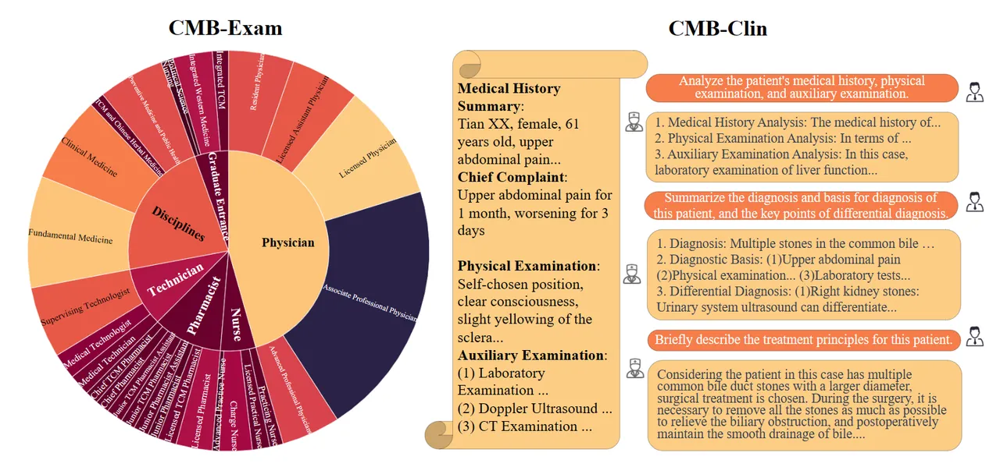

---
dataset_entry: true
dataset_name: "CMB"
dataset_path: "1-Dataset/CMB.md"
dimensions: ""
modality: ""
task_type: ""
anatomical_structures: ""
anatomical_area: ""
number_of_categories: ""
data_volume: ""
file_format: ""
source_url: "https://github.com/FreedomIntelligence/CMB/tree/main"
publication_date: "2023-08"
tags:
  - dataset
---
# CMB

<div align="center">
    <a href="https://github.com/openmedlab/"></a>
</div>
<p style="text-align:center;font-size:10px;"><em></em></p>

## Dataset Information

The Comprehensive Medical Benchmark in Chinese (CMB) was launched in 2023 by a research team from The Chinese University of Hong Kong, Shenzhen. CMB aims to provide a standardized evaluation platform for the performance of large language models (LLMs) in the medical field. One of its subsets, CMB-Exam, gathers a large collection of publicly available mock exam questions, course practice questions, and common misconception questions, primarily sourced from the Chinese Medical Question Database. The research team made these materials public after obtaining the official authorization to use the data. Compared to the conventional format of CMB-Exam, another subset, CMB-Clin, is somewhat more interesting. It is based on 74 real cases from textbooks, which are more complex and challenging than mere exam questions and are more akin to the interview scenarios of professional doctors, evaluating the reasoning capability of LLMs.

2023 was a year of rapid development for large model technology, and the field of medical question-answering attracted increasing attention under this momentum. How to properly evaluate the medical question-answering ability of large models is a valuable question. The establishment of CMB not only filled a gap in the field of Chinese medical assessment but also offered a new perspective for the localized evaluation of models by combining traditional Chinese medicine and modern medical knowledge. However, looking back in 2024, it's apparent that the total volume of exam data in vertical fields like medicine is relatively limited. Once the pioneers who are "quicker to the draw" have utilized all the main data, the evaluation of medical QA will need to evolve towards more granular dimensions, such as the fairness or credibility of Med QA LLMs (for example, directions like hallucination recognition). It's anticipated that the new year will bring datasets from these unique perspectives.

## Dataset Meta Information

| Task Type | Language | Train                                               | Val | Test | File Format | Size |
|-----------|----------|-----------------------------------------------------|-----|------|---------|------|
| QA        | Chinese  | 269,359 | 280 | 400+74  | .json   | 29.3MB |

## Dataset Information Statistics

<div align="center">
    <a href="https://github.com/openmedlab/"></a>
</div>
<p style="text-align:center;font-size:10px;"><em></em></p>

CMB-Clin only includes 74 cases, so there isn't much statistical analysis available; the main statistical analysis for CMB-Exam focuses on the types of questions, as shown in the pie chart above. More specific numerical results can be seen in the table below.

We referenced the National Standard Subject Classification of the People鈥檚 Republic of China, see https://xkb.pku.edu.cn/docs/2018-10/20220328083301969071.pdf.

| Category           | Subcategory                                                                                                                                                                                                                                                            | # Subject | # Questions |
|--------------------|------------------------------------------------------------------------------------------------------------------------------------------------------------------------------------------------------------------------------------------------------------------------|-----------|-------------|
| Physician (鍖诲笀)   | Resident Physician (浣忛櫌鍖诲笀); Licensed Assistant Physician (鍔╃悊鍖诲笀);  Licensed Physician (鎵т笟鍖诲笀); Associate Professional Physician (涓骇鑱岀О);  Advanced Professional Physicians (楂樼骇鑱岀О)                                                                                          | 81        | 124,926     |
| Nurse (鎶ょ悊)       | Practicing Nurse (鎶ゅ＋); Licensed Practical Nurse (鎵т笟鎶ゅ＋); Charge Nurse (涓荤鎶ゅ＋); Advanced Practice Nurse (楂樼骇鎵т笟鎶ゅ＋)                                                                                                                                                                                          | 8         | 16,919      |
| Technicians (鍖绘妧) | Medical Technician (鍖绘妧澹?; Medical Technologist (鍖绘妧甯?; Supervising Technologist (涓荤鎶€甯?                                                                                                                                                                                  | 21        | 27,004      |
| Pharmacist (鑽笀)  | Licensed Pharmacist (鎵т笟鑽笀); Licensed TCM Pharmacist (鎵т笟涓嵂甯?; Junior Pharmacist (鍒濈骇鑱岀О鑽笀); Junior Pharmacist Assistant (鍒濈骇鑱岀О鑽笀鍔╃悊); Junior TCM Pharmacist (鍒濈骇鑱岀О涓嵂甯?; Junior TCM Pharmacist Assistant (鍒濈骇鑱岀О涓嵂甯堝姪鐞?; Chief Pharmacists (涓荤鑽笀); Chief TCM Pharmacists (涓荤涓嵂甯? | 8         | 33,354      |
| Undergraduate Disciplines (鏈瀛︾) | Fundamental Medicine (鍩虹鍖诲); Clinical Medicine (涓村簥鍖诲); Traditional Chinese (TCM) and Chinese Herbal Medicine (涓尰瀛︿笌涓嵂瀛?;  Preventive Medicine and Public Health (棰勯槻鍖诲涓庡叕鍏卞崼鐢?                                                                                             | 53        | 62,271      |
| Graduate Entrance Exam (鐮旂┒鐢? | Integrated Western Medicine (瑗垮尰缁煎悎); Integrated TCM (涓尰缁煎悎); Political Science (鏀挎不); Nursing (鎶ょ悊瀛?                                                                                                                                                                       | 5         | 16,365      |
| **Total**          | 28                                                                                                                                                                                                                                                                     | **176**   | **280,839** |

Table 1: Statistics of the CMB-Exam Categories, Subcategories, Subjects, and Questions.

Overall, in the CMB-Exam dataset, the overwhelming majority of questions are physician QA questions, followed by subject exam questions, with test questions and nursing questions being the least common. This distribution is closely related to the popularity and demand for different types of questions in the real world.

## Dataset Example

The data format of CMB-Exam is as follows, similar to the written exam questions of an examination:

``` 
{
    "exam_type": "鍖诲笀鑰冭瘯",
    "exam_class": "鎵т笟鍖诲笀",
    "exam_subject": "鍙ｈ厰鎵т笟鍖诲笀",
    "question": "鎮ｈ€咃紝鐢锋€э紝11宀併€傝繎2涓湀鏉ユ椂鏈変綆鐑紙37锝?8鈩冿級锛屽叏韬棤鏄庢樉鐥囩姸銆傛煡浣撴棤鏄庢樉闃虫€т綋寰併€俋绾挎鏌ュ彂鐜板彸鑲轰腑閮ㄦ湁涓€鐩村緞绾?.8cm绫诲渾褰㈢梾鐏讹紝杈圭紭绋嶆ā绯婏紝鑲洪棬娣嬪反缁撹偪澶с€傛鐢峰鍙兘鎮?,
    "answer": "D",
    "question_type": "鍗曢」閫夋嫨棰?,
    "option": {
        "A": "灏忓彾鍨嬭偤鐐?,
        "B": "娴告鼎鎬ц偤缁撴牳",
        "C": "缁у彂鎬ц偤缁撴牳",
        "D": "鍘熷彂鎬ц偤缁撴牳",
        "E": "绮熺矑鍨嬭偤缁撴牳"
    }
},
```

The CMB-Clin data is stored in the following JSON format: for each case, there is a title and a detailed description, followed by multiple QA pairs. This is a common format for QA datasets.

``` 
{
    "id": "2",
    "title": "缁撱€佺洿鑲犱笌鑲涚鐤剧梾 妗堜緥鍒嗘瀽-鐥?,
    "description": "鐜扮梾鍙瞈n锛?锛夌梾鍙叉憳瑕乗n    鍛╔X锛岀敺锛?4宀侊紝2骞村墠鏃犳槑鏄捐鍥犲弽澶嶅嚭鐜拌倹闂ㄩ儴鑲跨墿鑴卞嚭锛屽彲鑷鍥炵撼锛?鍛ㄥ墠鍑虹幇澶т究鍚庣偣婊存牱鍑鸿锛屾棤鍙戠儹銆佹伓蹇冦€佸憰鍚愩€佽吂娉汇€俓n锛?锛変富璇塡n    鍙嶅鑲涢棬閮ㄨ偪鐗╄劚鍑?骞达紝渚胯1鍛ㄣ€俓n\n浣撴牸妫€鏌n缁撴灉 T36.8鈩冿紝P74娆?鍒嗭紝R20娆?鍒嗭紝Bp116/70mmHg銆俓n    鑷富浣撲綅锛岀蹇楁竻妤氾紝鍏ㄨ韩鐨偆鍙婂珐鑶滄棤榛勬煋锛屽叏韬祬琛ㄦ穻宸寸粨鏃犺偪澶с€備袱鑲哄懠鍚搁煶娓呮櫚锛屾湭闂诲強骞叉箍鍟伴煶銆傚績鐜?4娆?鍒嗭紝寰嬮綈锛屾湭闂诲強鐥呯悊鎬ф潅闊筹紝鑵归儴骞宠蒋锛岃倽銆佽劸鑴忚倠涓嬫湭瑙﹀強锛屾湭瑙﹀強鑵归儴鍖呭潡锛岃偁楦ｉ煶姝ｅ父銆俓n     涓撶鏌ヤ綋锛氭偅鑰呭乏渚у崸浣嶏紝鑲涘懆鏃犳簝鐤°€佺孩鑲裤€佺枻鐥曠瓑锛岃倹闂?鐐逛綅鍙鑲跨墿鑴卞嚭锛岀洿鑲犵┖铏氾紝鐩磋偁鍏夋粦锛屾湭鍙婅偪鐗╋紝鏃犲帇鐥涳紝鎸囧閫€鍑烘棤琛€鏌撱€俓n\n杈呭姪妫€鏌n锛?锛夊疄楠屽妫€鏌n    琛€甯歌 WBC 6.02脳109/L锛孨 70%锛孯BC 3.15脳109/L锛孒b 103g/L锛岃倽鍔熻兘銆佽偩鍔熻兘鍧囨甯搞€俓n锛?锛夊績鐢靛浘\n    绐︽€у績寰嬨€俓n锛?锛夎兏鐗嘰n    蹇冭偤鏈鏄庢樉寮傚父銆俓n锛?锛夌氦缁寸粨鑲犻暅妫€鏌n    鎵€瑙佸洖鑲犳湯绔€佺粨鐩磋偁绮樿啘鏈寮傚父锛涚棓銆?,
    "QA_pairs": [
        {
            "question": "鍒嗘瀽鏈緥鐥呬汉鐨勭梾鍙层€佷綋鏍兼鏌ュ拰杈呭姪妫€鏌ャ€?,
            "answer": "锛?锛夌梾鍙插垎鏋愶細璇ョ梾渚嬬梾鍙叉瘮杈冪畝鍗曪紝鑲涢棬閮ㄨ偪鐗╄劚鍑猴紝浼存湁澶т究鍚庣偣婊存牱鍑鸿锛岄渶瑕佽杩涗竴姝ョ殑杈呭姪妫€鏌ヤ互鏄庣‘璇婃柇銆傝繘涓€姝ユ鏌ヤ富瑕佹槸閽堝鏄惁瀛樺湪杩滅鑲犻亾鐤剧梾锛岃鑰冭檻鍒拌偁閬撹偪鐦ゃ€佹伅鑲変互鍙婄洿鑲犺劚鍨傜瓑銆俓n    鏈梾渚嬬壒鐐逛负锛氣憼鍙嶅鑲涢棬閮ㄨ偪鐗╄劚鍑猴紱鈶′究鍚庣偣婊存牱鍑鸿銆俓n   锛?锛変綋鏍兼鏌ュ垎鏋愶細鑲涢棬7鐐逛綅鍙鑲跨墿鑴卞嚭锛岀洿鑲犵┖铏氾紝鐩磋偁鍏夋粦锛屾湭鍙婅偪鐗╋紝鏃犲帇鐥涳紝鎸囧閫€鍑烘棤琛€鏌擄紝鍙垵姝ユ帓闄ょ洿鑲犺劚鍨傘€佺洿鑲犺偪鐦ゃ€佹伅鑲夌瓑鐥呭彶銆俓n   锛?锛夎緟鍔╂鏌ュ垎鏋愶細鏈緥鐥呬汉瀹為獙瀹ゆ鏌ヤ腑涓昏鏄甯歌鏈夎交搴﹁传琛€鐨勮〃鐜帮紝鎻愮ず鐥呬汉鍙兘鏈変竴涓參鎬уけ琛€鐨勮繃绋嬨€?
        },
        {
            "question": "绠€杩版湰渚嬬梾浜虹殑璇婃柇鍙婅瘖鏂緷鎹紝閴村埆璇婃柇瑕佺偣銆?,
            "answer": "锛?锛夎瘖鏂細娣峰悎鐥擻n   锛?锛夎瘖鏂緷鎹細鈶犲弽澶嶈倹闂ㄩ儴鑲跨墿鑴卞嚭2骞达紝渚胯1鍛ㄣ€傗憽浣撴牸妫€鏌ュ彂鐜拌倹闂ㄥ彲瑙佽倹闂?鐐逛綅鍙鑲跨墿鑴卞嚭銆傗憿瀹為獙瀹ゆ鏌ワ細绾㈢粏鑳炶鏁板強琛€绾㈣泲鐧芥按骞充笅闄嶃€傗懀绾ょ淮缁撹偁闀滄鏌ワ細杩滅鑲犻亾鏈寮傚父銆俓n   锛?锛夐壌鍒瘖鏂細鈶犵粨鐩磋偁鑲跨槫锛氳偁闀滄湭瑙佸紓甯革紝鍙帓闄ゃ€傗憽鐩磋偁鑴卞瀭锛氭寚妫€鐩磋偁绌鸿櫄锛岃偁闀滄湭瑙佸紓甯搞€?
        },
        {
            "question": "绠€杩版湰渚嬬梾浜虹殑娌荤枟鍘熷垯銆?,
            "answer": "鏈緥鎮ｈ€呮偅鑰呯棁鐘舵槑鏄撅紝褰卞搷鐢熸椿璐ㄩ噺锛岃€冭檻琛屾墜鏈不鐤楋紝鏌ヤ綋鍙鐥旂柈浠ュ崟涓棓鏍镐负涓伙紝鑰冭檻琛屾贩鍚堢棓澶栧墺鍐呮墡鏈€傛湳鍚庝簣杞寲澶т究绛夊鐥囧鐞嗐€?
        }
    ]
},
```

## File Structure

The dataset file structure is as follows: as a small-scale simple test set, CMB-Clin uses a single JSON file to save all data.

``` 
CMB-Clin
|鈥斺€斺€斺€?CMB-Clin-qa.json
```

## Authors and Institutions

Xidong Wang (The Chinese University of Hong Kong)
Guiming Hardy Chen (The Chinese University of Hong Kong)
Dingjie Song (The Chinese University of Hong Kong)
Zhiyi Zhang (The Chinese University of Hong Kong)
Zhihong Chen (The Chinese University of Hong Kong)
Qingying Xiao (The Chinese University of Hong Kong)
Feng Jiang (The Chinese University of Hong Kong)
Jianquan Li (The Chinese University of Hong Kong)
Xiang Wan (The Chinese University of Hong Kong)
Benyou Wang (The Chinese University of Hong Kong)
Haizhou Li (The Chinese University of Hong Kong)

## Source Information

Official Website: https://github.com/FreedomIntelligence/CMB/tree/main

Download Link: https://github.com/FreedomIntelligence/CMB/blob/main/data/CMB.zip

Article Address: https://arxiv.org/abs/2308.08833

Publication Date: 2023-08

## Citation

``` 
@article{wang2023cmb,
  title={CMB: A Comprehensive Medical Benchmark in Chinese},
  author={Wang, Xidong and Chen, Guiming Hardy and Song, Dingjie and Zhang, Zhiyi and Chen, Zhihong and Xiao, Qingying and Jiang, Feng and Li, Jianquan and Wan, Xiang and Wang, Benyou and others},
  journal={arXiv preprint arXiv:2308.08833},
  year={2023}
}
```

Original introduction article is [here](https://zhuanlan.zhihu.com/p/685444407).
