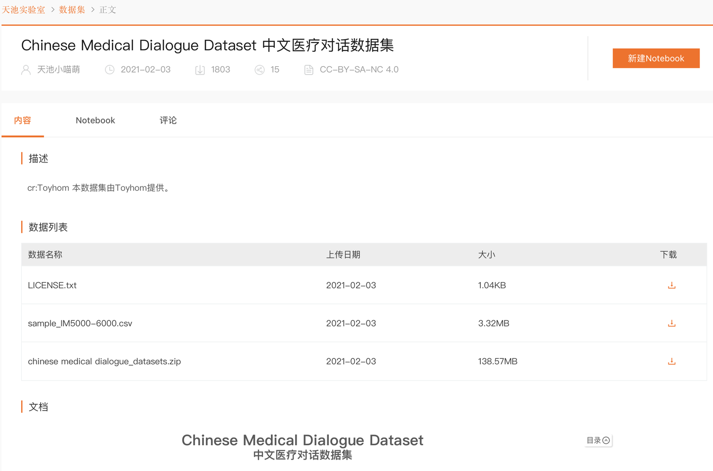

---
dataset_entry: true
dataset_name: "Chinese Medical Dialogue Dataset"
dataset_path: "1-Dataset/ChineseMedicalDialogueDataset.md"
dimensions: ""
modality: ""
task_type: ""
anatomical_structures: ""
anatomical_area: ""
number_of_categories: ""
data_volume: ""
file_format: ""
source_url: "https://tianchi.aliyun.com/dataset/90163"
publication_date: "2021.2"
tags:
  - dataset
---
# Chinese Medical Dialogue Dataset

<div align="center">
    <a href="https://github.com/openmedlab/"></a>
</div>
<p style="text-align:center;font-size:10px;"><em></em></p>

## Dataset Information

The "Chinese medical dialogue data" dataset consists of 792,099 question and answer pairs, covering six major medical specialties including andrology, internal medicine, gynecology and obstetrics, oncology, pediatrics, and surgery. The detailed categorization and rich content of this dataset provide researchers with a valuable resource for deeply exploring Chinese medical dialogue processing technologies, especially in the fields of natural language processing (NLP) and machine learning (ML).

In the construction and application of large models in the medical field, the significance of this dataset is particularly important. It not only helps researchers train more accurate models to understand and generate medically related dialogues but also provides a foundation for developing efficient, intelligent medical consultation and decision-support systems, greatly advancing the application and development of artificial intelligence technologies in the healthcare sector.

## Dataset Meta Information

| Task Type | Language | Train                                               | Val | Test | File Format | Size |
|-----------|----------|-----------------------------------------------------|-----|------|--------|------|
| QA        | Chinese  | 792099 | -   | -    | .csv   |      |


## Dataset Information Statistics

| file                                 | QA pairs |
|--------------------------------------|-----------------------|
| Andriatria_鐢风                        | 94596                   |
| IM_鍐呯 (Internal Medicine)            | 220606                  |
| OAGD_濡囦骇绉?(Obstetrics and Gynecology) | 183751              |
| Oncology_鑲跨槫绉?                        | 75553             |
| Pediatric_鍎跨                         | 101602             |
| Surgical_澶栫                          | 115991             |

## Dataset Example


``` 
    {
        "instruction": "鐜板湪浣犳槸涓€涓缁忚剳澶栫鍖荤敓锛岃鏍规嵁鎮ｈ€呯殑闂缁欏嚭寤鸿锛?,
        "input": "鐧棲鐥呰兘鍚冨痉宸撮噾鍚楋紝閿欒锛屾湁鏃跺€欐劅瑙夌湅鍒扮殑鍜屽惉鍒扮殑涓嶅お涓€鏍枫€?,
        "output": "宸撮噾鏄箍璋辨姉鐥呰嵂鐗╋紝涓昏浣滅敤浜庝腑鏋㈢缁忕郴缁燂紝瀵瑰姩鐗╃殑鑽悊鐮旂┒鍙戠幇寰峰反閲戝鍚勭鐧棲鐨勫疄楠屾ā鍨嬶紙鍏ㄨ韩鎬у拰閮ㄥ垎鎬э級鍧囨湁鎶楁儕鍘ヤ綔鐢紝瀵逛汉鐨勫悇绉嶇被鍨嬬櫕鐥彂浣滄湁鎶戝埗浣滅敤锛屼綔鐢ㄦ満鐞嗗彲鑳戒笌澧炲姞纬-姘ㄥ熀涓侀吀鐨勬祿搴︽湁鍏炽€?涓昏鏄不鐧棲鑽墿銆傚缓璁湪鍖荤敓鐨勭煡閬撲笅锛岀敤鑽紝绁濇偍韬綋鏃╂棩搴峰銆?
    },
    {
        "instruction": "鐜板湪浣犳槸涓€涓敓娈栧尰瀛︾鍖荤敓锛岃鏍规嵁鎮ｈ€呯殑闂缁欏嚭寤鸿锛?,
        "input": "鐢锋€ц緭绮剧鍫靛鐨勭棁鐘朵細鍑虹幇浠€涔堬紝鐢锋€ц緭绮剧鍫靛鐨勭棁鐘朵細鍑虹幇浠€涔堬紵杈撶簿绠″牭濉炵殑鐥囩姸浼氭湁鍝簺锛?,
        "output": "杈撶簿绠″牭濉炵殑鐥囩姸涓€\n杈撶簿绠￠亾鐨勫厛澶╂€ф闃伙細鍏堝ぉ鎬ц緭绮剧缂哄鎴栭棴濉炪€佸厛澶╂€ч檮鐫惧彂鑲蹭笉鑹€侀檮鐫句笌鐫句父涓嶈繛鎺ャ€佸厛澶╂€х簿鍥婄己濡傛垨灏勭簿绠＄己濡傘€俓n杈撶簿绠″牭濉炵殑鐥囩姸浜孿n杈撶簿绠￠亾鐨勬劅鏌擄細杩欎竴杈撶簿绠″牭濉炵殑鐥囩姸鏈夌粨鏍搞€佹穻鐥呭強琛€涓濊櫕鐥咃紝褰撶粨鏍告潌鑿屼镜鍙婅緭绮剧澹侊紝浣胯緭绮剧澹佸鍘氾紝杈撶簿绠″彉纭彉绮楋紝鍛堜覆鐝犵姸锛岀梾鍙樺彲娌胯緭绮剧钄撳欢鍒伴檮鐫惧熬锛岀劧鍚庢尝鍙婃暣涓檮鐫惧拰鐫句父銆傜悆鑿屾劅鏌撲富瑕佺牬鍧忛檮鐫惧熬閮紝寰堝皯渚靛強闄勭澗澶达紝杈撶簿绠′篃甯稿父鍙楃疮銆備笣铏梾鎰熸煋渚靛強杈撶簿绠°€侀檮鐫炬椂锛屽悓鏍峰彲閫犳垚鍏堕樆濉炶€屼笉閫氥€傚綋鎰熸煋渚靛強鍓嶅垪鑵恒€佺簿鍥婃椂锛岃緭绮剧閬撴闃荤棁鐘跺彲琛ㄧ幇"
    },

```

## File Structure

The structure of the dataset consists of six folders corresponding to six different medical departments: Andriatria_鐢风 (Urology), IM_鍐呯 (Internal Medicine), OAGD_濡囦骇绉?(Gynecology and Obstetrics), Oncology_鑲跨槫绉?(Oncology), Pediatric_鍎跨 (Pediatrics), and Surgical_澶栫 (Surgery). Each folder contains one CSV file with the medical dialogue data for that particular department.

``` 
.
|
|--  Andriatria_鐢风
|--  IM_鍐呯
|--  OAGD_濡囦骇绉?
|--  Oncology_鑲跨槫绉?|--  Pediatric_鍎跨
`--  Surgical_澶栫
```

## Authors and Institutions

The dataset is provided by Toyhom, and it is available on GitHub at the repository "Toyhom/Chinese-medical-dialogue-data," which hosts the Chinese medical dialogue data set.

## Source Information

Official Website: https://tianchi.aliyun.com/dataset/90163

Download Link: https://tianchi.aliyun.com/dataset/90163

Article Address: -

Publication Date: 2021.2

## Citation

``` 
TBD
```

Original introduction article is [here](https://zhuanlan.zhihu.com/p/684811168).
