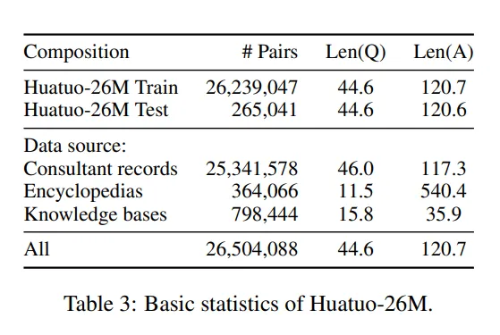
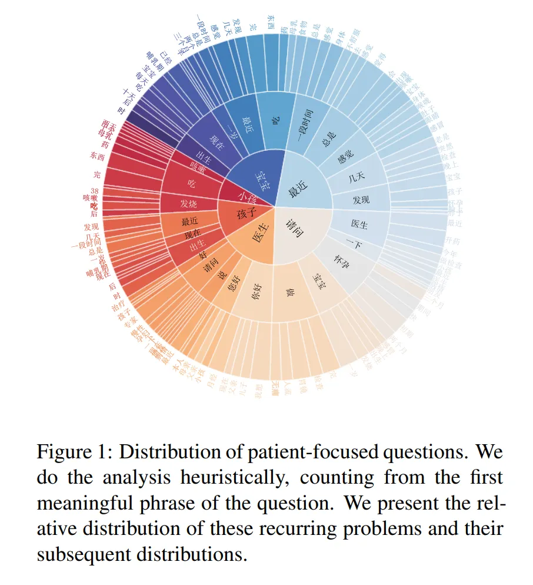

---
dataset_entry: true
dataset_name: "Huatuo-26M"
dataset_path: "1-Dataset/Huatuo-26M.md"
dimensions: ""
modality: ""
task_type: ""
anatomical_structures: ""
anatomical_area: ""
number_of_categories: ""
data_volume: ""
file_format: ""
source_url: "https://github.com/FreedomIntelligence/Huatuo-26M"
publication_date: "2023.5"
tags:
  - dataset
---
# Huatuo-26M

<div align="center">
    <a href="https://github.com/openmedlab/"></a>
</div>
<p style="text-align:center;font-size:10px;"><em></em></p>

## Dataset Information

Named after Huatuo, a great ancient Chinese physician, the Huatuo-26M dataset is currently the largest Chinese medical question and answer dataset, containing 26 million QA pairs. These pairs are meticulously compiled from multiple sources, including online medical consultation websites, medical encyclopedias, and medical knowledge bases, through text cleaning and data deduplication methods, covering a wide range of medical knowledge. The creation of this dataset has significantly expanded the scale of the medical field Q&A dataset and provided an unprecedented resource for research in natural language processing and artificial intelligence in the Chinese medical domain.

The launch of Huatuo-26M not only commemorates Huatuo's contributions but also provides robust support for the development of large medical models. By offering a vast number of authentic and diverse medical QA pairs, it aids in enhancing the performance of medical question-answering systems and strengthens the models' understanding and generative capabilities. Moreover, the dataset has proven its value in various applications, including zero-shot learning, retrieval-enhanced generation, and serving as pre-training corpora to improve the performance of pre-trained language models. Thus, Huatuo-26M provides a valuable resource for researchers and developers in building more efficient and accurate medical consultation and auxiliary diagnosis systems. It poses challenges to existing models while making significant contributions to AI development in medical research and healthcare.

## Dataset Meta Information

| Task Type | Language | Train                                               | Val | Test | File Format | Size |
|-----------|----------|-----------------------------------------------------|-----|------|---------|------|
| QA        | Chinese  | 26,239,047 | -   | 264,041  | .json   | 5.3GB |


## Dataset Information Statistics

<div align="center">
    <a href="https://github.com/openmedlab/"></a>
</div>
<p style="text-align:center;font-size:10px;"><em></em></p>

<div align="center">
    <a href="https://github.com/openmedlab/"></a>
</div>
<p style="text-align:center;font-size:10px;"><em></em></p>

## Dataset Example

[huatuo_encyclopedia_qa](https://huggingface.co/datasets/FreedomIntelligence/huatuo_encyclopedia_qa) example:

``` 
{
'question': [ [ "鏇插尮鍦板皵鐗囩殑鐢ㄦ硶鐢ㄩ噺" ] ],
'answer': [ "娉ㄦ剰锛氬悓绉嶈嵂鍝佸彲鐢变簬涓嶅悓鐨勫寘瑁呰鏍兼湁涓嶅悓鐨勭敤娉曟垨鐢ㄩ噺銆傛湰鏂囧彧渚涘弬鑰冦€傚鏋滀笉纭畾锛岃鍙傜湅鑽搧闅忓甫鐨勮鏄庝功鎴栧悜鍖荤敓璇㈤棶銆傚彛鏈嶃€備竴娆?0锝?00mg锛?-2鐗囷級锛?娆?鏃ワ紝鎴栭伒鍖诲槺銆? ]
}
```

[huatuo_knowledge_graph_qa](https://huggingface.co/datasets/FreedomIntelligence/huatuo_knowledge_graph_qa) example:

``` 
{
鈥榪uestion鈥? [ "棰滈潰閮ㄥ嚬闄风殑鎵嬫湳娌荤枟鏈変簺浠€涔堬紵" ],
鈥榓nswer鈥? [ "鑷綋棰楃矑鑴傝偑绉绘锛涜嚜浣撹剛鑲Щ妞嶏紱鑷綋鑴傝偑骞茬粏鑳炵Щ妞嶏紱鑷綋鑴傝偑棰楃矑绉绘" ]
}
```

[huatuo_consultation_qa](https://huggingface.co/datasets/FreedomIntelligence/huatuo_consultation_qa) example:

```
{
'question': [ "浣犲ソ锛佽闂潯瑙夌潯鍒板崐澶滄€绘槸鍙ｅ共鑸屽共鐨勩€佸奖鍝嶄紤鎭€佹槸..." ],
'answer': [ "https://www.51zyzy.com/question/detail/10391424.html" ]
}
```

Huatuo-Lite example:

``` 
{
'id': 22,647,835,
'answer': '娌荤枟榧讳腑闅斿亸鏇茬殑鏂规硶鏈夋墜鏈拰闈炴墜鏈不鐤椾袱绉嶏紝鎵嬫湳娌荤枟鏄€氳繃鎵嬫湳鐭榧讳腑闅斿亸鏇诧紝闈炴墜鏈不鐤楀垯鏄€氳繃鑽墿娌荤枟鍜岀墿鐞嗘不鐤楁潵缂撹В鐥囩姸銆傛墜鏈不鐤楁槸娌荤枟榧讳腑闅斿亸鏇茬殑鏈€鏈夋晥鏂规硶锛屾墜鏈悗闇€瑕佹敞鎰忎紤鎭紝閬垮厤鍓х儓杩愬姩鍜屼綆澶村伐浣滐紝鍚屾椂涔熻娉ㄦ剰楗锛屽皯鍚冭緵杈ｉ鐗╁拰涓嶅枬閰掋€傛墜鏈悗涓ゅ懆鍐呴蓟娑曟垨鐥颁腑鍑虹幇琛€姘存垨琛€鍧楁槸姝ｅ父鐜拌薄锛岃嫢鍑虹幇澶ч噺鍑鸿銆佸彂鐑с€佸墽鐑堢柤鐥涙椂璇峰敖閫熷氨鍖汇€?,
'score': 5,
'label': '鐪艰€抽蓟鍠夌',
'question': '涓婁釜鏈堟劅鍐掍簡锛屼篃娌℃湁鐢ㄨ嵂锛屾劅鍐掑ソ浜嗕互鍚庡氨瑙夊緱榧诲瓙缁忓父涓嶉€氱晠锛岄蓟瀛愯繕缁忓父鏅︽皵绾㈢毊銆佸彂鐥掋€佽€屼笖杩樹細鏈夊ご鏅曪紝涓€鐩撮兘浠ヤ负鏄笂娆℃劅鍐掔暀涓嬬殑鍚庨仐鐥囷紝鍘诲尰闄㈡鏌ワ紝妫€鏌ョ粨鏋滃嚭鏉ヤ互鍚庤鏄蓟涓殧鍋忔洸銆傝闂浣曟不鐤楅蓟涓殧鍋忔洸锛?,
'related_diseases': '榧讳腑闅斿亸鏇?
}
```

## File Structure

The Huatuo-26M dataset primarily includes:

- Online medical encyclopedia: [huatuo_encyclopedia_qa](https://huggingface.co/datasets/FreedomIntelligence/huatuo_encyclopedia_qa)
- Medical knowledge graph: [huatuo_knowledge_graph_qa](https://huggingface.co/datasets/FreedomIntelligence/huatuo_knowledge_graph_qa)
- Public medical Q&A forums on the internet (with answers in the form of URLs): [huatuo_consultation_qa](https://huggingface.co/datasets/FreedomIntelligence/huatuo_consultation_qa)
- A simplified version: Huatuo-Lite

For each of these four parts, the file structure is as follows:

``` 
# huatuo_encyclopedia_qa
.
|--  train_datasets.jsonl
|--  validation_datasets.jsonl
`--  test_datasets,jsonl

# huatuo_knowledge_graph_qa
.
|--  train_datasets.jsonl
|--  validation_datasets.jsonl
`--  test_datasets,jsonl

# huatuo_consultation_qa
.
|--  train_datasets.jsonl
|--  validation_datasets.jsonl
`--  test_datasets,jsonl

# Huatuo-Lite
. format_data.jsonl
```

## Authors and Institutions

Jianquan Li (The Chinese University of Hong Kong, Shenzhen)

Xidong Wang (The Chinese University of Hong Kong, Shenzhen)

Xiangbo Wu (The Chinese University of Hong Kong, Shenzhen)

Zhiyi Zhang (The Chinese University of Hong Kong, Shenzhen)

Xiaolong Xu (The Chinese University of Hong Kong, Shenzhen)

Jie Fu (Beijing Academy of Artificial Intelligence)

Xiang Wan (Shenzhen Institute of Big Data)

Benyou Wang (Shenzhen Institute of Big Data)

## Source Information

Official Website: https://github.com/FreedomIntelligence/Huatuo-26M

Download Link: https://github.com/FreedomIntelligence/Huatuo-26M

Article Address: https://arxiv.org/pdf/2305.01526v1.pdf

Publication Date: 2023.5

## Citation

``` 
@misc{li2023huatuo26m,
      title={Huatuo-26M, a Large-scale Chinese Medical QA Dataset}, 
      author={Jianquan Li and Xidong Wang and Xiangbo Wu and Zhiyi Zhang and Xiaolong Xu and Jie Fu and Prayag Tiwari and Xiang Wan and Benyou Wang},
      year={2023},
      eprint={2305.01526},
      archivePrefix={arXiv},
      primaryClass={cs.CL}
}
```

Original introduction article is [here](https://zhuanlan.zhihu.com/p/684831046).
