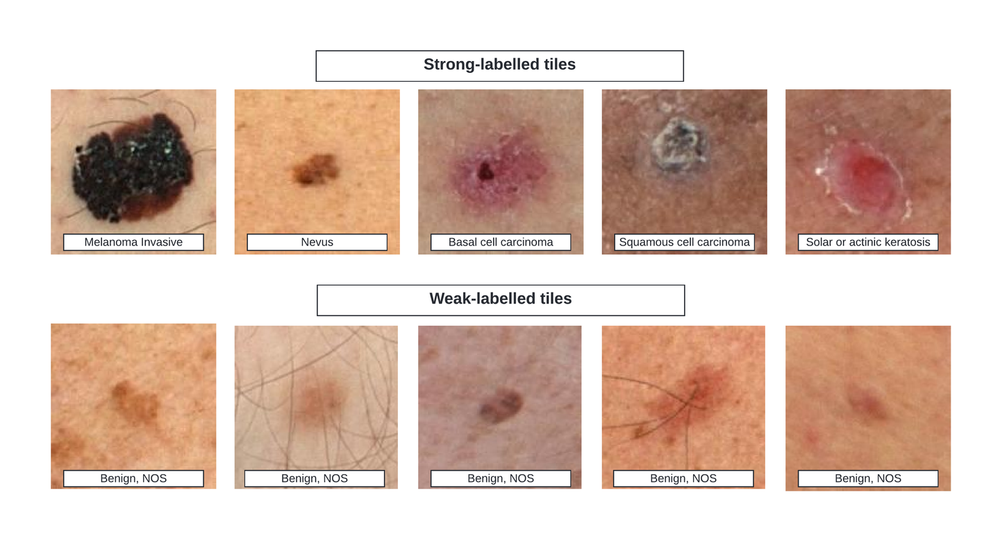

---
dataset_entry: true
dataset_name: "ISIC-2024"
dataset_path: "1-Dataset/ISIC-2024.md"
dimensions: ""
modality: ""
task_type: ""
anatomical_structures: ""
anatomical_area: ""
number_of_categories: ""
data_volume: ""
file_format: ""
source_url: "https://www.kaggle.com/competitions/isic-2024-challenge"
publication_date: "2024-06"
tags:
  - dataset
---
# ISIC-2024

<div align="center">
    <a href="https://github.com/openmedlab/"></a>
</div>
<p style="text-align:center;font-size:10px;"><em></em></p>

## Dataset Information

**ISIC 2024** is a large-scale dermoscopic image classification dataset released by the International Skin Imaging Collaboration (ISIC) and is also part of a workshop for MICCAI 2024. Compared to ISIC 2020, this dataset includes a greater number of images and provides more detailed annotations. The data were collected from nine institutions worldwide and include images from 5,349 patients.

The **ISIC 2024 dataset** serves as a valuable resource for developing automated skin lesion diagnosis systems and plays a crucial role in the early detection of skin cancer. With its diverse sources covering multiple institutions and a large number of patients globally, the dataset better represents the characteristics of skin lesions across different ethnicities and regions. This diversity helps improve the generalizability and accuracy of AI models. Beyond supporting medical diagnosis, the dataset may also facilitate the development of personal skin health assessment tools, thereby promoting the early detection and timely treatment of skin cancer, ultimately improving patient outcomes.

## Dataset Meta Information

| Dimensions | Modality     | Task Type      | Anatomical Area | Number of Categories    | Data Volume | File Format |
|------------|--------------|----------------|-----------------|-------------------------|-------------|-------------|
| 2D         | dermoscopic  | Classification | Skin            | 6 or 33                 | 81722        | JPG         |


### Resolution Details

| Dataset Statistics | size          |
|--------------------|---------------|
| min                | (85, 85)      |
| median             | (2268, 1984)  |
| max                | (7360, 4912)  |

## Label Information Statistics

### Weak Label

Weak label refers to only labeling benign/malignant.

| Label                          | Malignant (鎭舵€? | Benign (鑹€? | Indeterminate (鏃犳硶纭畾) | Indeterminate/Benign (鏃犳硶纭畾/鑹€? | Indeterminate/Malignant (鏃犳硶纭畾/鎭舵€? | Unlabeled (鏈爣娉? |
|--------------------------------|------------------|---------------|---------------------------|--------------------------------------|---------------------------------------|-------------------|
| Occurrences                    | 9,239           | 64,047        | 150                       | 67                                   | 85                                   | 8,134             |
| Percentage                     | 11.31%          | 78.37%        | 0.18%                     | 0.08%                                | 0.10%                                | 9.95%             |


### Strong Label

Strong label refers to the detailed disease type.

| Label                                           | Occurrences | Percentage |
|------------------------------------------------|-------------|------------|
| nevus (鐥?                                     | 32,697      | 39.98%     |
| Unlabeled (鏈爣娉?                             | 27,896      | 34.11%     |
| melanoma (榛戣壊绱犵槫)                            | 7,349       | 8.98%      |
| basal cell carcinoma (鍩哄簳缁嗚優鐧?              | 4,921       | 6.02%      |
| seborrheic keratosis (鑴傛孩鎬ц鍖栫梾)            | 1,926       | 2.36%      |
| squamous cell carcinoma (槌炵姸缁嗚優鐧?           | 1,372       | 1.68%      |
| actinic keratosis (鏃ュ厜鎬ц鍖栫梾)               | 1,367       | 1.67%      |
| pigmented benign keratosis (鑹茬礌鎬ц壇鎬ц鍖栫梾)  | 1,339       | 1.64%      |
| solar lentigo (鏃ュ厜鎬ч泙鏂?                     | 562         | 0.69%      |
| dermatofibroma (鐨偆绾ょ淮鐦?                   | 420         | 0.51%      |
| vascular lesion (琛€绠＄梾鍙?                    | 348         | 0.43%      |
| lichenoid keratosis (鑻旇棑鏍疯鍖栫梾)            | 312         | 0.38%      |
| acrochordon (鐨禈)                             | 301         | 0.37%      |
| lentigo NOS (鏈壒鎸囩殑闆€鏂?                    | 241         | 0.29%      |
| atypical melanocytic proliferation (闈炲吀鍨嬮粦绱犵粏鑳炲鐢? | 143         | 0.17%      |
| AIMP (闈炲吀鍨嬩笉纭畾榛戠礌缁嗚優澧炵敓)              | 121         | 0.15%      |
| verruca (鐤?                                   | 119         | 0.15%      |
| angioma (琛€绠＄槫)                               | 71          | 0.09%      |
| lentigo simplex (鍗曠函鎬ч泙鏂?                  | 43          | 0.05%      |
| melanoma metastasis (榛戣壊绱犵槫杞Щ)            | 39          | 0.05%      |
| other (鍏朵粬)                                   | 33          | 0.04%      |
| scar (鐦㈢棔)                                    | 31          | 0.04%      |
| neurofibroma (绁炵粡绾ょ淮鐦?                     | 26          | 0.03%      |
| angiokeratoma (琛€绠¤鍖栫槫)                    | 13          | 0.02%      |
| sebaceous hyperplasia (鐨剛鑵哄鐢?            | 7           | 0.01%      |
| clear cell acanthoma (閫忔槑缁嗚優妫樼毊鐦?         | 6           | 0.01%      |
| atypical spitz tumor (闈炲吀鍨婼pitz鐦?          | 5           | 0.01%      |
| atypical fibroma or fibrous papule (琛€绠＄氦缁寸槫鎴栫氦缁存€т笜鐤? | 4           | 0.00%      |
| pyogenic granuloma (鍖栬創鎬ц倝鑺借偪)             | 3           | 0.00%      |
| cafe-au-lait macule (鍜栧暋鏂?                  | 2           | 0.00%      |
| sebaceous adenoma (鐨剛鑵鸿吅鐦?                | 2           | 0.00%      |
| mucosal melanosis (绮樿啘榛戞枒)                  | 2           | 0.00%      |
| nevus spilus (鏂戠棧)                            | 1           | 0.00%      |


## Visualization

<div align="center">
    <a href="https://github.com/openmedlab/"></a>
</div>
<p style="text-align:center;font-size:10px;"><em>The first row is the strong label, and the second row is the week label.</em></p>

## File Structure

The ISIC2024 dataset contains a `train` directory for storing training images, and a `metadata.csv` file that lists the patient information and diagnosis results corresponding to each image.

``` 
ISIC2024
|--  images
|--  ISIC_7559201.jpg
`--  ...
`--  licenses
`--  attribution.txt
`--  image.hdf5
`--  image_256sq.hdf5
`-- metadata.csv
```

## Authors and Institutions

The datasets come from 9 different institutions:

- Memorial Sloan Kettering Cancer Center, New York, USA 

- Dermatology Service, Melanoma Unit, Hospital Cl铆nic de Barcelona, IDIBAPS, Universitat de Barcelona, Barcelona, Spain, ITOBOS 

- The University of Queensland, Brisbane, Australia 

- FNQH Cairns, Westcourt, Australia

- Melanoma Institute Australia, Sydney, Australia 

- Department of Dermatology at the University Hospital of Basel, Basel, Switzerland 

- Department of Dermatology, Medical University of Vienna, Vienna, Austria 

- Department of Dermatology, University of Athens Medical School, Athens, Greece 

- Monash University at the Alfred Hospital, Melbourne, Australia

## Source Information

Official Website: https://www.kaggle.com/competitions/isic-2024-challenge

Download Link: https://www.kaggle.com/datasets/tomooinubushi/all-isic-data-20240629/data

Article Address: TBD

Publication Date: 2024-06

## Citation

``` 
@misc{isic-2024-challenge,
    author = {Nicholas Kurtansky, Veronica Rotemberg, Maura Gillis, Kivanc Kose, Walter Reade, Ashley Chow},
    title = {ISIC 2024 - Skin Cancer Detection with 3D-TBP},
    publisher = {Kaggle},
    year = {2024},
    url = {https://kaggle.com/competitions/isic-2024-challenge}
}
```

Original introduction article is [here](https://zhuanlan.zhihu.com/p/740355817).
