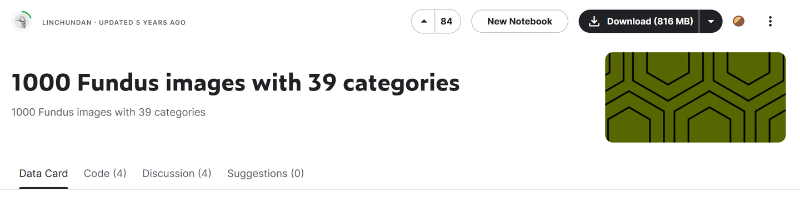
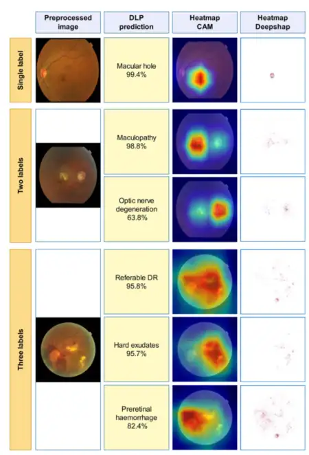

---
dataset_entry: true
dataset_name: "JSIEC"
dataset_path: "1-Dataset/JSIEC.md"
dimensions: "2D"
modality: "Fundus"
task_type: "Classification"
anatomical_structures: "Eye"
anatomical_area: "Eye"
number_of_categories: "39"
data_volume: "1000"
file_format: "JPG"
source_url: "https://www.kaggle.com/datasets/linchundan/fundusimage1000"
publication_date: "2021"
tags:
  - dataset
---
# JSIEC

<div align="center">
    <a href="https://github.com/openmedlab/"></a>
</div>
<p style="text-align:center;font-size:10px;"><em></em></p>

## Dataset Information

The JSIEC dataset consists of a total of 209,494 fundus images, covering 39 categories. This article introduces a subset of the JSIEC dataset, which includes 1,000 fundus images distributed across 39 categories. This dataset collects fundus images from 7 different data sources for the development and validation of deep learning algorithms. The primary datasets for training, validation, and testing come from the Picture Archiving and Communication System (PACS) of the Joint Shantou International Eye Center (JSIEC) in China, China's Lifeline Express Diabetic Retinopathy Screening System (LEDRS), and the Eye Picture Archiving and Communication System (EyePACS) in the USA.

Millions of people worldwide are affected by fundus diseases such as Diabetic Retinopathy (DR), Age-related Macular Degeneration (AMD), Retinal Vein Occlusion (RVO), Retinal Artery Occlusion (RAO), Glaucoma, Retinal Detachment (RD), and fundus tumors. Among these, DR, AMD, and Glaucoma are the most common causes of vision impairment in most populations. Without accurate diagnosis and timely appropriate treatment, these fundus diseases can lead to irreversible blurring of vision, visual distortion, field defects, and even blindness. However, in rural and remote areas, especially in developing countries, there is a lack of ophthalmic services and ophthalmologists, making early detection and timely referral for treatment often inaccessible. Notably, fundus photography provides basic detection of these diseases and is available and affordable in most parts of the world. Non-professionals can handle fundus photographs and send them online to major ophthalmic institutions for follow-up. Artificial intelligence technology can be used to assist in diagnosis.

## Dataset Meta Information

| Dimensions | Modality | Task Type      | Anatomical Structures | Anatomical Area | Number of Categories | Data Volume | File Format |
|------------|----------|----------------|-----------------------|-----------------|----------------------|-------------|-------------|
| 2D         | Fundus   | Classification | Eye                   | Eye             | 39                   | 1000        | JPG         |


### Resolution Details

| Dataset Statistics | size             |
|--------------------|------------------|
| min                | (576, 768, 3)    |
| median             | (2236, 2656, 3)  |
| max                | (2572, 3046, 3)  |

## Label Information Statistics

| Disease                                        | Number of Images | Disease                                 | Number of Images |
|------------------------------------------------|------------------|-----------------------------------------|------------------|
| Normal (0)                                     | 38               | CRVO (20)                               | 22               |
| Tessellated (1)                                | 13               | Yellow-white spots-flecks (21)          | 29               |
| Large optic cup (2)                            | 50               | Cotton-wool spots (22)                  | 10               |
| DR1 (3)                                        | 18               | Vessel tortuosity (23)                  | 14               |
| Possible glaucoma (4)                          | 13               | Chorioretinal atrophy-coloboma (24)     | 15               |
| Optic atrophy (5)                              | 12               | Preretinal hemorrhage (25)              | 10               |
| DR2 (6)                                        | 49               | Fibrosis (26)                           | 10               |
| DR3 (7)                                        | 39               | Laser Spots (27)                        | 20               |
| Severe hypertensive (8)                        | 15               | Silicon oil in eye (28)                 | 19               |
| Disc swelling and elevation (9)                | 13               | Blur fundus without PDR (29)            | 111              |
| Dragged Disc (10)                              | 10               | Blur fundus with suspected PDR (30)     | 45               |
| Congenital disc abnormality (11)               | 10               | RAO (31)                                | 16               |
| Retinitis pigmentosa (12)                      | 22               | Rhegmatogenous RD (32)                  | 57               |
| Bietti Crystalline Dystrophy (13)              | 8                | CSCR (33)                               | 14               |
| Peripheral Retinal Degeneration and Break (14) | 14               | VKH Disease (34)                        | 14               |
| Myelinated Nerve Fiber (15)                    | 11               | Maculopathy (35)                        | 74               |
| Vitreous Particles (16)                        | 14               | ERM (36)                                | 26               |
| Fundus Neoplasm (17)                           | 8                | MH (37)                                 | 23               |
| BRVO (18)                                      | 44               | Pathological Myopia (38)                | 54               |
| Massive Hard Exudates (19)                     | 13               |                                         |                  |

The English equivalents in the table are translated into Chinese as follows:

- (0) Normal - 姝ｅ父
- (1) Tessellated - 椹禌鍏嬫牱
- (2) Large optic cup - 澶ц鐩樺嚬闄?- (3) DR1 - 绯栧翱鐥呰缃戣啘鐥呭彉1鏈?- (4) Possible glaucoma - 鍙兘鎬ч潚鍏夌溂
- (5) Optic atrophy - 瑙嗙缁忚悗缂?- (6) DR2 - 绯栧翱鐥呰缃戣啘鐥呭彉2鏈?- (7) DR3 - 绯栧翱鐥呰缃戣啘鐥呭彉3鏈?- (8) Severe hypertensive - 涓ラ噸楂樿鍘嬫€ц缃戣啘鐥呭彉
- (9) Disc swelling and elevation - 瑙嗙洏鑲胯儉鍜岄殕璧?- (10) Dragged Disc - 瑙嗙洏鎷栨洺
- (11) Congenital disc abnormality - 鍏堝ぉ鎬ц鐩樺紓甯?- (12) Retinitis pigmentosa - 鑹茬礌鎬ц缃戣啘鐐?- (13) Bietti crystalline dystrophy - Bietti鏅剁姸浣撹惀鍏讳笉鑹?- (14) Peripheral retinal degeneration and break - 鍛ㄨ竟瑙嗙綉鑶滃彉鎬у拰瑁傚瓟
- (15) Myelinated nerve fiber - 鏈夐珦绁炵粡绾ょ淮
- (16) Vitreous particles - 鐜荤拑浣撻绮?- (17) Fundus neoplasm - 鐪煎簳鑲跨槫
- (18) BRVO - 瑙嗙綉鑶滃垎鏀潤鑴夐樆濉?- (19) Massive hard exudates - 澶ч噺纭€ф笚鍑?- (20) CRVO - 瑙嗙綉鑶滀腑澶潤鑴夐樆濉?- (21) Yellow-white spots-flecks - 榛勭櫧鐐?- (22) Cotton-wool spots - 妫夌诞鏂?- (23) Vessel tortuosity - 琛€绠¤總鏇?- (24) Chorioretinal atrophy-coloboma - 鑴夌粶鑶滆缃戣啘钀庣缉-缂烘崯
- (25) Preretinal hemorrhage - 瑙嗙綉鑶滃墠鍑鸿
- (26) Fibrosis - 绾ょ淮鍖?- (27) Laser Spots - 婵€鍏夋枒鐐?- (28) Silicon oil in eye - 鐪煎唴纭呮补
- (29) Blur fundus without PDR - 鏃犲娈栨€х硸灏跨梾瑙嗙綉鑶滅梾鍙樼殑妯＄硦鐪煎簳
- (30) Blur fundus with suspected PDR - 鎬€鐤戞湁澧炴畺鎬х硸灏跨梾瑙嗙綉鑶滅梾鍙樼殑妯＄硦鐪煎簳
- (31) RAO - 瑙嗙綉鑶滃姩鑴夐樆濉?- (32) Rhegmatogenous RD - 瑁傚瓟鎬ц缃戣啘鑴辩
- (33) CSCR - 涓績鎬ф祮娑叉€ц剦缁滆啘瑙嗙綉鑶滅梾鍙?- (34) VKH disease - Vogt-灏忔煶-鍘熺敯缁煎悎寰?- (35) Maculopathy - 榛勬枒鐥呭彉
- (36) ERM - 榛勬枒鍓嶈啘
- (37) MH - 榛勬枒瑁傚瓟
- (38) Pathological myopia - 鐥呯悊鎬ц繎瑙?
## Visualization

<div align="center">
    <a href="https://github.com/openmedlab/"></a>
</div>
<p style="text-align:center;font-size:10px;"><em> Paper Visualization.</em></p>

## File Structure

The file structure of the dataset is as follows: images are stored in the 'images' folder, and annotations for the train and test sets are provided in TXT format.

``` 
JSIEC
|--  images
|--  xxx.jpg
|--  xxx.jpg
|    |     ...
|--  train.txt
|--  test.txt
```

## Authors and Institutions

Ling-Ping Cen (Joint Shantou International Eye Centre of Shantou University)

Jie Ji ( Network & Information Centre, Shantou University)

## Source Information

Official Website: https://www.kaggle.com/datasets/linchundan/fundusimage1000

Download Link: https://www.kaggle.com/datasets/linchundan/fundusimage1000

Article Address: https://www.nature.com/articles/s41467-021-25138-w#citeas

Publication Date: 2021

## Citation

``` 
@article{cen2021automatic,
  title={Automatic detection of 39 fundus diseases and conditions in retinal photographs using deep neural networks},
  author={Cen, Ling-Ping and Ji, Jie and Lin, Jian-Wei and Ju, Si-Tong and Lin, Hong-Jie and Li, Tai-Ping and Wang, Yun and Yang, Jian-Feng and Liu, Yu-Fen and Tan, Shaoying and others},
  journal={Nature communications},
  volume={12},
  number={1},
  pages={4828},
  year={2021},
  publisher={Nature Publishing Group UK London}
}
```

Original introduction article is [here](https://zhuanlan.zhihu.com/p/703930854).
