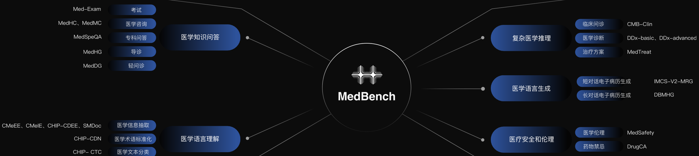
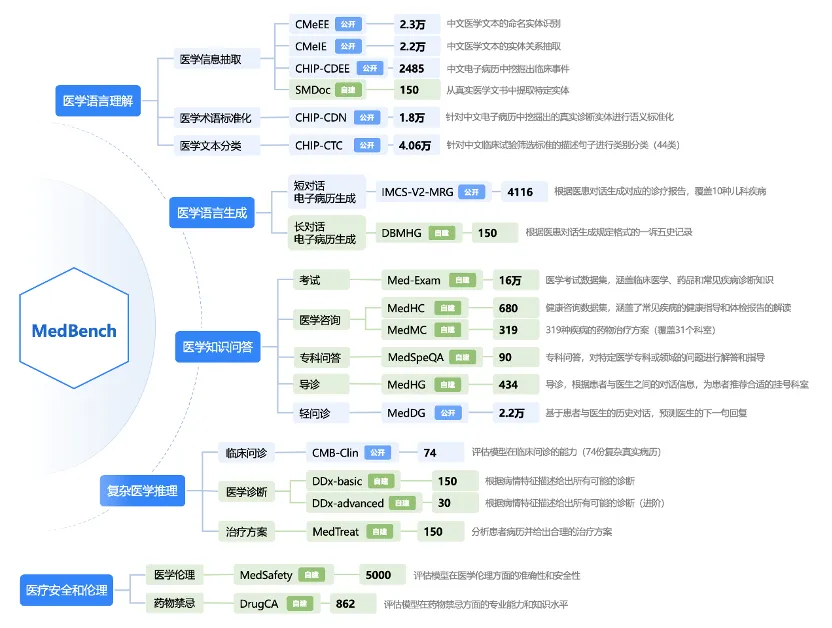

---
dataset_entry: true
dataset_name: "MedBench"
dataset_path: "1-Dataset/MedBench.md"
dimensions: ""
modality: ""
task_type: ""
anatomical_structures: ""
anatomical_area: ""
number_of_categories: ""
data_volume: ""
file_format: ""
source_url: "https://medbench.opencompass.org.cn/"
publication_date: "2023-12"
tags:
  - dataset
---
# MedBench

<div align="center">
    <a href="https://github.com/openmedlab/"></a>
</div>
<p style="text-align:center;font-size:10px;"><em></em></p>

## Dataset Information

MedBench is a large-scale, high-quality Chinese medical mega-model evaluation dataset. Based on authoritative medical standards, MedBench has set up 5 major dimensions, including **medical language understanding**, **medical language generation**, **medical knowledge Q&A**, **complex medical reasoning**, and **medical safety and ethics**. It comprises **15** tasks, **20** datasets, and **300,000** questions, providing an objective and scientific performance evaluation reference for Chinese medical mega-models. MedBench is built on **8** public datasets and **12** self-constructed datasets, encompassing scenarios such as medical exams, medical Q&A, patient services, medical inquiries, medical record analysis, medical record generation, and assisted diagnosis, covering **57** clinical departments.

## Dataset Meta Information

| Task Type | Language | Train | Val | Test    | File Format | Size |
|-----------|----------|-------|-----|---------|---------|------|
| QA        | Chinese  | -     | -   | 300,000 | .json   | 81MB |


## Dataset Information Statistics

The figure below shows the official statistics for the data volume of 8 public datasets (marked in blue) and 12 self-constructed datasets (marked in green).

<div align="center">
    <a href="https://github.com/openmedlab/"></a>
</div>
<p style="text-align:center;font-size:10px;"><em></em></p>

## Dataset Example

### Medical Knowledge Q&A: Examination

Med-Exam Example is as follows:
``` 
{"passage": null, "question": "鐢凤紝58宀併€?骞村墠鏇捐鐩磋偁鐧屾牴娌绘湳锛岃繎3涓湀鍙充笂鑵瑰強鑳岄儴鑳€鐥涳紝鏃犲彂鐑紝澶т究姝ｅ父銆傛煡浣擄細閿侀涓婃湭瑙﹀強鑲垮ぇ娣嬪反缁擄紝鑵瑰钩杞紝鏈Е鍙婅偪鐗╋紝鑲濊倠涓嬫湭瑙﹀強銆傚疄楠屽妫€鏌ワ細琛€WBC10脳10/L锛孉FP鏃犲崌楂樸€傝吂閮˙瓒呯ず锛氳倽鍙冲彾澶氫釜瀹炴€у崰浣嶏紝鏈€澶х洿寰勭害3cm銆傞鍏堝簲鑰冭檻鐨勮瘖鏂槸锛熻闂涓哄崟閫夐」棰橈紝璇风洿鎺ュ洖绛旀纭殑閫夐」锛屼笉瑕佽繘琛岃В閲婂拰鍒嗘瀽銆傚€欓€夐」涓篈: 闃跨背宸磋倽鑴撹偪锛孊: 鑲濊绠＄槫锛孋: 澶氬彂鑲濆泭鑲匡紝D: 鍘熷彂鎬ц倽鐧岋紝E: 鑲濊浆绉荤檶", "options": ["A: 闃跨背宸磋倽鑴撹偪", "B: 鑲濊绠＄槫", "C: 澶氬彂鑲濆泭鑲?, "D: 鍘熷彂鎬ц倽鐧?, "E: 鑲濊浆绉荤檶"], "answer": null, "other": {"source": "Med-Exam", "id": 1}}
```

### Medical Knowledge Q&A: Medical Consultation

Med-HC Example is as follows:
``` 
{"passage": null, "question": "蹇冭剰瓒呭０鐨勯€傚簲璇?, "options": null, "answer": null, "other": {"source": "MedHC"}}
```

Med-MC Example is as follows:
``` 
{"passage": null, "question": "棰堝姩鑴夌嫮绐勬€庝箞鐢ㄨ嵂锛?, "options": null, "answer": null, "other": {"source": "MedMC"}}
```

### Medical Knowledge Q&A: Health Guidance

Med-HG Example is as follows:
``` 
{"passage": null, "question": "绉戝鍊欓€夊垪琛ㄤ负锛氭€ヨ瘖绉戙€佽偪鐦ょ銆佽绠″绉戙€佸皬鍎跨缁忓绉戙€佽€抽蓟鍜藉枆澶撮澶栫銆佹暣褰㈠绉戙€佺缁忓唴绉戙€佸皬鍎垮唴鍒嗘硨浠ｈ阿绉戙€佸皬鍎挎秷鍖栧唴绉戙€佹斁灏勭銆佷骇绉戙€佹秷鍖栧唴绉戙€佸皬鍎块绉戙€佺敓娈栧尰瀛︿腑蹇冦€佺溂绉戙€佸皬鍎块婀垮厤鐤銆佺缁忓绉戙€佺毊鑲ょ銆佸績鑳稿绉戙€佹櫘澶栫銆佸皬鍎挎劅鏌撶銆佸彛鑵旂銆佸皬鍎垮唴绉戙€佸皬鍎跨缁忓唴绉戙€佸皬鍎挎櫘澶栫銆佸懠鍚稿唴绉戙€佸绉戙€佷复搴婅惀鍏荤銆佷复搴婂績鐞嗙銆佸績琛€绠″唴绉戙€佽倹鑲犲绉戙€侀婀垮厤鐤銆佹牳鍖诲绉戙€佸彂鑲茶涓哄効绔ヤ繚鍋ョ銆侀绉戙€佸皬鍎垮懠鍚稿唴绉戙€佷綋妫€涓績銆佸悍澶嶅尰瀛︾銆佷钩鑵哄绉戙€佸皬鍎胯偩鑴忓唴绉戙€佸叏绉戝尰瀛︾銆佸皬鍎挎硨灏垮绉戙€佸唴鍒嗘硨浠ｈ阿绉戙€佹劅鏌撶銆佹硨灏垮绉戙€佽偩鑴忓唴绉戙€佸皬鍎胯娑茶偪鐦ょ銆佽娑插唴绉戙€佸皬鍎垮績鑴忎腑蹇冦€傛偅鑰咃細涓ラ噸渚跨3骞达紝鐢凤紝42宀併€傚簲璇ユ帹鑽愭偅鑰呭幓鍝釜绉戝锛?, "options": null, "answer": null, "other": {"source": "瀵艰瘖"}}
```

### Medical Knowledge Q&A: Light Health Guidance

Med-DG Example is as follows:
```
{"passage": null, "question": "鏍规嵁鍖荤敓鍜屾偅鑰呬氦娴佺殑瀵硅瘽鍘嗗彶棰勬祴鍑哄尰鐢熺殑涓嬩竴鍙ュ洖澶嶏細\\n鎮ｈ€咃細浣犲ソ锛屾垜鏈夋參鎬ц儍鐐庯紝鏈€杩戠┖鑵瑰氨涓€鐩寸柤鐥涳紝璇烽棶鍖荤敓鑳戒笉鑳芥帹鑽愪竴浜涗究鑽粰鎴戯紙鐢凤紝23宀侊級鍖荤敓锛氫綘濂斤紒杩欐牱鐨勬儏鍐靛涔呬簡锛熸偅鑰咃細浠ュ墠涓嶆敞鎰忕殑鎯呭喌灏变細銆傛偅鑰咃細鏈€杩戜竴涓槦鏈熼兘杩欐牱銆傛偅鑰咃細鎴戝睘浜庤儍瀵掑瀷鐨勩€俓\n绛旓細", "options": null, "answer": "杩欎釜鎯呭喌寤鸿鑳冮暅妫€鏌ョ‘璇婁竴涓嬨€?, "other": {"source": "MedDG"}}
```

### Medical Language Generation: Short Conversation Electronic Medical Record Generation

IMCS-V2-MRG Example is as follows:
```
鐨勮瘖鐤楁姤鍛婏細\n闂瘖瀵硅瘽鍘嗗彶锛歕n鎮ｈ€咃細鍖荤敓浣犲ソ锛屾垜濂冲効鍜冲椊锛屽閲屼笉鍜筹紝灏辨槸涓€鍚冧笢瑗垮氨鍜冲緱鍘夊锛岃闂槸浠€涔堝師鍥狅紵\n鍖荤敓锛氫綘濂絓n鎮ｈ€咃細浣犲ソ\n鍖荤敓锛氬瀛愬挸鍡藉嚑澶╀簡\n鎮ｈ€咃細鏈変竴涓槦鏈熶簡\n鍖荤敓锛氭湁鍙戠儳鍚楋紵\n鍖荤敓锛氬挸鍡芥湁鐥板悧锛焅n鎮ｈ€咃細涓嶅彂鐑э紝鏈夌棸\n鍖荤敓锛氬幓褰撳湴鍏珛鍖婚櫌妫€鏌ヨ繃鍚楋紵\n鎮ｈ€咃細娌℃湁锛屽湪绉佷汉璇婃墍鎵撹繃閽圽n鍖荤敓锛氭不鐤椾互鍚庢晥鏋滄€庝箞鏍凤紵\n鍖荤敓锛氬挸鍡借杞诲惂\n鎮ｈ€咃細杞荤偣浜哱n鍖荤敓锛氫絾鏄繕鏄挸鍡斤紝鐥版瘮杈冨鏄悧锛焅n鎮ｈ€咃細灏辨槸鍚冮キ鏃跺挸\n鎮ｈ€咃細鐥颁笉澶歕n鍖荤敓锛氭牴鎹綘璇寸殑瀛╁瓙鐨勬儏鍐点€傚挸鍡芥湁鐥拌繖杩樻槸鍛煎惛閬撶殑鐤剧梾\n鍖荤敓锛氭垜鑰冭檻瀛╁瓙杩樻槸鎮ｆ湁涓婂懠鍚搁亾鎰熸煋鐨勩€俓n鎮ｈ€咃細鍝︼紝瑕佸悆浠€涔堣嵂锛焅n鍖荤敓锛氱潃鍑夋劅鏌撲互鍚庨兘浼氬紩璧蜂笂鍛煎惛閬撴劅鏌撶殑銆俓n鍖荤敓锛氬瀛愮幇鍦ㄧ簿绁炲ソ鍚楋紵鍚冮キ鍙互鍚楋紵\n鎮ｈ€咃細濂界殑\n鍖荤敓锛氶偅杩樺ソ鏍规嵁瀛╁瓙鐩墠鐨勬儏鍐垫病鏈夊彂鐑х簿绁炴瘮杈冨ソ锛屽悆楗篃鍙互銆傜粡杩囨不鐤楃梾鎯呬篃鏄噺杞荤殑锛屽彲浠ョ户缁彛鏈嶈嵂鐗╃紦瑙ｄ竴涓嬨€俓n鍖荤敓锛氬彲浠ラ€傚綋鐨勬妸鑽墿璋冩暣涓€涓嬨€備綘鐜板湪鍚冪殑浠€涔堣嵂锛屾墦鐨勪粈涔堥拡銆俓n鍖荤敓锛氱粡杩囨不鐤楄櫧鐒剁梾鎯呭噺杞伙紝浣嗘槸杩樻槸鍜冲椊锛岃繖鏄梾鎯呰繕娌℃湁瀹屽叏鎺у埗浣忕殑銆俓n鍖荤敓锛氱幇鍦ㄥ悆鐨勪粈涔堣嵂鐗╋紵鐭ラ亾鍚嶅瓧鍚楋紵\n鎮ｈ€咃細灏忓効姝㈠挸绯栨祮锛屽ご瀛n鎮ｈ€咃細涓嶆墦閽堜簡\n鍖荤敓锛氬悆浜嗗嚑澶╁暒锛焅n鎮ｈ€咃細涔熸湁鍥涗簲澶‐n鍖荤敓锛氫綘涓婅竟鐨勮嵂鐗╁彲浠ョ户缁悆鐨勩€俓n鎮ｈ€咃細鍝︼紝\n鍖荤敓锛氬彲浠ワ紝鍐嶅姞涓婃皑婧寸储鍙ｆ湇娑层€傚拰灏忓効鍙岄噾娓呯儹瑙ｆ瘨鍙ｆ湇娑瞈n鍖荤敓锛氫粩缁嗙湅璇存槑锛屾寜璇存槑涔﹀悆銆俓n鍖荤敓锛氳繖鍥涚鑽墿涓€璧峰悆鏁堟灉杩樻槸姣旇緝濂界殑\n鍖荤敓锛氬姞寮烘姢鐞嗕笉瑕佺潃鍑夌殑涓嶈鍚冭緵杈ｇ殑涓滆タ锛屽鍚冭敩鑿滃拰姘存灉銆俓n鎮ｈ€咃細濂界殑锛岃阿璋n鍖荤敓锛氫笂鍛煎惛閬撴劅鏌撲竴鑸殑锛屼竴鍛ㄥ乏鍙充細鎭㈠濂界殑銆俓n鍖荤敓锛氫絾鏄瀛愬皬涓婂懠鍚搁亾鎰熸煋寰堝鏄撳紩璧锋皵绠＄値鍜岃偤鐐庣殑銆俓n鍖荤敓锛氱户缁彛鏈嶈嵂鐗╀笁鍒板洓澶╄瀵熷彉鍖栥€俓n鎮ｈ€咃細鍝︼紝鐭ラ亾浜哱n鍖荤敓锛氬鏋滃挸鍡藉挸鐥颁笉瑙佸ソ杞氨鍘诲綋鍦板叕绔嬪尰闄㈠皬鍎垮唴绉戝氨璇婃鏌ャ€俓n鍖荤敓锛氬寲楠岃甯歌鎷嶈兏鐗囩湅鏄惁鏈夋皵绠＄値鍜岃偤鐐庛€俓n鍖荤敓锛氬湪閲囧彇閫傚綋鐨勬不鐤楁帾鏂斤紝鏁堟灉杩樺ソ銆俓n鎮ｈ€咃細鎭‐n鍖荤敓锛氬鏋滃悎骞舵皵绠＄値鍜岃偤鐐庛€傚彛鏈嶈嵂鐗╂晥鏋滄槸涓嶅ソ鐨勶紝搴旇闈欒剦杈撴恫鏁堟灉杩樻槸姣旇緝濂界殑銆俓n鍖荤敓锛氬ソ鐨勭户缁彛鏈嶈嵂鐗╅厤鍚堬紝鍔犲己鎶ょ悊銆傝瀵熺梾鎯呭彉鍖栧浣昞n鍖荤敓锛氬鏋滃彛鏈嶈嵂鐗╀笁鑷冲洓澶┿€傛病鏈夊挸鍡藉拰鍜崇棸浜嗗彲浠ュ仠姝㈣嵂鐗╃殑\n鍖荤敓锛氬彛鏈嶈嵂涓夎嚦鍥涘ぉ濡傛灉娌℃湁鍜冲椊鍜屽挸鐥帮紝杩欐槸鐥呮儏鎭㈠浜嗭紝鍙互鍋滄湇鑽墿鐨刓n璇存槑锛氳瘖鐤楁姤鍛婂垎涓轰富璇? 鐜扮梾鍙? 杈呭姪妫€鏌? 鏃㈠線鍙? 璇婃柇, 寤鸿杩欏叚涓珷鑺傘€俓n\n瑕佹眰锛歕n1. 瀵逛簬姣忎釜琛ㄩ」锛屼粠瀵硅瘽涓彁鍙栧苟鎬荤粨瀵瑰簲鐨勪俊鎭繘琛屽～鍏咃紱\n2. 鍚屼竴绫诲埆鐨勫绉嶄俊鎭敤鍙ュ彿\"銆俓"鍒嗛殧锛沑n3. 濡傛灉琛ㄩ」鐨勫唴瀹瑰湪瀵硅瘽涓病鏈夋彁鍙婏紝灏嗚〃椤圭殑鍊肩疆涓衡€滄棤鈥濓紱\n4. 杈撳嚭鏍煎紡涓庝俊鎭娊鍙栫殑琛ㄥ崟涓€鑷达紝涓嶈杈撳嚭鍏跺畠鏍煎紡銆俓n\n杈撳嚭濉厖鍚庣殑琛ㄥ崟锛?, "options": null, "answer": null, "others": {"source": "IMCS-MRG"}}鍖诲璇█鐢熸垚-闀垮璇濈數瀛愮梾鍘嗙敓鎴?```

### Medical Language Generation: Long Conversation Electronic Medical Record Generation

DBMHG Example is as follows:
```
{"question": "鎮ｈ€呯殑涓€璇変簲鍙茶〃鍗曞涓嬶細\n涓昏瘔锛歕n鐜扮梾鍙诧細\n鏃㈠線鍙诧細\n涓汉鍙诧細\n濠氳偛鍙诧細\n瀹舵棌鍙诧細\n\n浠庝互涓嬪尰鎮ｅ璇濅腑鎻愬彇淇℃伅锛屽～鍏呬互涓婅〃鍗曪細\n鎮ｈ€咃細璇烽棶涓婂懠鍚搁亾鎰熸煋鍙互鍚冧簺浠€涔堟秷鐐庤嵂鍛紵锛堢敺锛?6宀侊級\n鍖荤敓锛氫綘濂斤紝涓婂懠鍚搁亾鎰熸煋鏄敱浜庣粏鑿屾垨鐥呮瘨鎰熸煋寮曡捣鐨勶紝濡傛灉浼存湁鍜抽粍鐥拌€冭檻鏄粏鑿屾劅鏌擄紝鍙互鍙ｆ湇澶村绫昏嵂鐗╋紝闃垮闇夌礌绫伙紝鎴栧柟璇洪叜鑽墿娌荤枟鐨刓n鎮ｈ€咃細鍡撳瓙鐤硷紝鍜冲椊\n鍖荤敓锛氬彲浠ュ彛鏈嶅乏姘ф盁娌欐槦杩欑鎶楃値鑽墿娌荤枟鐨勶紝浣嗘槸涓嶈兘閰掑悗鏈嶇敤鐨刓n鎮ｈ€咃細鍝﹀摝锛岃阿璋紒\n鍖荤敓锛氫笉瀹㈡皵\n\n瑕佹眰锛歕n1. 瀵逛簬姣忎釜琛ㄩ」锛屼粠瀵硅瘽涓彁鍙栧苟鎬荤粨瀵瑰簲鐨勪俊鎭繘琛屽～鍏咃紱\n2. 濡傛灉琛ㄩ」鐨勫唴瀹瑰湪瀵硅瘽涓病鏈夋彁鍙婏紝灏嗚〃椤圭殑鍊肩疆涓衡€滄棤鈥濓紱\n3. 杈撳嚭鏍煎紡涓庝竴璇変簲鍙茶〃鍗曚竴鑷达紝涓嶈杈撳嚭鍏跺畠鏍煎紡銆俓n\n杈撳嚭濉厖鍚庝竴璇変簲鍙茶〃鍗曪細", "options": null, "answer": null, "other": {"source": "DBMHG"}}
```

### Complex Medical Reasoning: Clinical Consultation

CMB-Clin Example is as follows:
```
{"question": "鐜扮梾鍙瞈n锛?锛夌梾鍙叉憳瑕乗n    寰怷X锛屽コ锛?6宀侊紝鍙戠幇3骞达紝鍙充笂鑵归殣鐥?0澶╋紝鏃犻粍鐤革紝鏃犲彂鐑€佹棤鎭跺績銆佸憰鍚愩€佽吂娉伙紝鏃犺倽鐐庣梾鍙层€俓n锛?锛変富璇塡n    鍙戠幇3骞达紝鍙充笂鑵归殣鐥?0澶┿€俓n\n浣撴牸妫€鏌n缁撴灉 T36.8鈩冿紝P72娆?鍒嗭紝R16娆?鍒嗭紝Bp126/70mmHg銆俓n    鑷富浣撲綅锛岀蹇楁竻妤氾紝鍏ㄨ韩鐨偆鍙婂珐鑶滄棤榛勬煋锛屽叏韬祬琛ㄦ穻宸寸粨鏃犺偪澶с€備袱鑲哄懠鍚搁煶娓呮櫚锛屾湭闂诲強骞叉箍鍟伴煶銆傚績鐜?2娆?鍒嗭紝寰嬮綈锛屾湭闂诲強鐥呯悊鎬ф潅闊筹紝鑵归儴骞宠蒋锛屽彸涓婅吂鍘嬬棝锛岃倽鑴捐剰鏈Е鍙婏紝鏈Е鍙婅吂閮ㄥ寘鍧楋紝鑲犻福闊虫甯搞€俓n\n杈呭姪妫€鏌n锛?锛夊疄楠屽妫€鏌n    琛€甯歌 WBC 7.7脳109/L锛孨 77.4%,RBC 3.7脳109/L锛孒b 118g/L锛岃倽鍔熻兘銆佽偩鍔熻兘鍧囨甯搞€俓n锛?锛夊鏅嫆瓒呭０妫€鏌n    鑳嗗泭澶у皬绾?.7cm脳4.8cm锛屽鍘氱害0.2cm锛屽泭鍐呰鐩村緞1.8cm寮哄洖澹板洟锛屽０褰憋紙+锛夛紝绉诲姩锛?锛夈€俓n锛?锛塁T妫€鏌n    鑳嗗泭澶у皬姝ｅ父锛屽涓嶅帤锛屽泭鍐呰楂樺瘑搴︾粨鐭冲奖锛岀洿寰勭害1.8cm銆俓n\n杈呭姪妫€鏌n瓒呭０鎻愮ず鑳嗗泭鍐呴珮鍥炲０鍥紝澹板奖锛?锛夛紝绉诲姩锛?锛塡nCT鎻愮ず鑳嗗泭鍐呴珮瀵嗗害褰盶n绠€杩版湰渚嬬梾浜虹殑璇婃柇鍙婅瘖鏂緷鎹紝閴村埆璇婃柇瑕佺偣銆?, "options": null, "answer": null, "other": {"source": "CMB-Clin"}}
```

### Complex Medical Reasoning: Medical Diagnosis

DDx-basic Example is as follows:
```
{"question": "\"- 浜哄彛缁熻淇℃伅锛氫腑骞寸敺鎬с€俓n- 鐥囩姸琛ㄧ幇锛氭偅鑰呰繎鍑犱釜鏈堝湪椋熺敤杈涜荆鍒烘縺鎬ч鐗╁悗鍑虹幇鑳搁鍚庨殣鐥涳紝闂存柇鎬у彂浣滐紝鐤肩棝涓嶅悜鍏朵粬閮ㄤ綅鏀惧皠锛屼即鏈夊弽閰稿拰鍡虫皵銆傝繖浜涚棁鐘朵富瑕佸湪楗遍鍚庢垨澶滈棿鍙戜綔锛屾寔缁椂闂撮暱鐭笉涓€锛屼笌浣撳姏娲诲姩娌℃湁鏄庢樉鍏宠仈锛屼笉浼存湁鍛曞悙銆佸績鎮告垨鍜冲椊銆俓n- 涓村簥鍏虫敞鐐癸細蹇冪數鍥炬樉绀虹鎬у績寰嬶紝鏈寮傚父銆俓n- 鏃㈠線娌荤枟鍜屾墜鏈彶锛氭偅鑰呭钩鏃惰韩浣撳仴搴凤紝鏈彁鍙婂叾浠栨不鐤楁垨鎵嬫湳鍙层€俓n- 鑽墿娌荤枟鍙插拰杩囨晱鍙诧細鎮ｈ€呰嚜琛屾湇鐢ㄩ摑纰抽吀闀侊紝鐥囩姸鍙殏鏃剁紦瑙ｏ紝鏈彁鍙婂叾浠栬嵂鐗╂不鐤楀彶鎴栬繃鏁忓彶銆俓n- 瀹舵棌鍙诧細鏈彁鍙婂鏃忛仐浼犵梾鍙层€俓n- 鍚哥儫楗厭鍙诧細鎮ｈ€呮湁鍗佸勾鍚哥儫鍙诧紝姣忓ぉ绾︿竴鍖呭崐銆俓n- 绯荤粺鍥為【锛氭湭鎻愬強鍏朵粬寮傚父鎯呭喌锛岀梾绋嬩腑锛屾偅鑰呬綋閲嶆棤鏄庢樉鍙樺寲銆俓"\n\n涓婅堪涓烘煇鎮ｈ€呯殑涓€浠界梾鍘嗕俊鎭瑕侊紝璇风粨鍚堟偅鑰呯殑涓昏淇℃伅锛屽湪浠ヤ笅閫夐」涓€夋嫨璇ユ偅鑰呭彲鑳芥偅鏈夌殑澶氱鐤剧梾锛岀粨鏋滀互閫夐」灞曠ず鍗冲彲锛屾棤闇€缁欏嚭鐞嗙敱銆傞€夐」涓猴細\nA. 鑳冮绠″弽娴佺梾\nB. 鍐犵姸鍔ㄨ剦绮ユ牱纭寲鎬у績鑴忕梾\nC. 璐查棬澶卞紱缂撶棁\nD. 椋熺鐧孿nE. 甯︾姸鐤辩柟\n绛旓細", "options": ["A. 鑳冮绠″弽娴佺梾", "B. 鍐犵姸鍔ㄨ剦绮ユ牱纭寲鎬у績鑴忕梾", "C. 璐查棬澶卞紱缂撶棁", "D. 椋熺鐧?, "E. 甯︾姸鐤辩柟"], "answer": null, "other": {"source": "DDx-basic", "id": 1}}
```

DDx-advanced Example is as follows:
``` 
{"question": "浠ヤ笅鏄偅鑰呬俊鎭細\n- 浜哄彛缁熻淇℃伅锛氭偅鑰呮槸涓€浣嶄腑骞寸敺鎬э紝闀挎湡鐢熸椿鍦ㄥ箍涓滅殑涓€涓ぇ鍩庡競銆俓n- 鐥囩姸琛ㄧ幇锛氭偅鑰呯殑涓昏鐥囩姸鏄笂鑵归儴鐨勬寔缁柤鐥涳紝杩欏凡缁忔寔缁簡鍑犱釜鏈堬紝鑰屼笖涓庨ギ椋熸棤鍏炽€備粬涔熸病鏈夊憰鍚愩€佸弽閰告垨鍡虫皵鐨勭棁鐘躲€傛澶栵紝浠栬繕鍙戠幇鑷繁鐨勫ぇ渚块鑹插彉榛戯紝杩欑鎯呭喌宸叉寔缁簡涓€涓鏈堛€備粬杩樿〃绀鸿嚜宸辨湁浜涚柌鍊︼紝鑴歌壊鑻嶇櫧锛屽苟涓斾綋閲嶅ぇ骞呬笅闄嶃€傜敱浜庤繖浜涚棁鐘讹紝浠栬鍒濇璇婃柇涓衡€滄秷鍖栭亾鍑鸿鈥濓紝骞惰鏀跺叆娑堝寲鍐呯杩涜杩涗竴姝ョ殑妫€鏌ュ拰娌荤枟銆俓n- 涓村簥鍏虫敞鐐癸細鎮ｈ€呮病鏈夋秷鍖栭亾婧冪枴鍜岃倽鐐庣殑鐥呭彶锛屼絾浠栫殑鑲洪儴鍛煎惛闊冲湪鍙充笂閮ㄥ噺寮憋紝浼存湁鍙╄瘖娴婇煶銆備粬鐨勪笂鑵归儴鏈夊帇鐥涳紝浣嗘病鏈夊弽璺崇棝锛岃偁楦ｉ煶娲昏穬锛屾病鏈夌Щ鍔ㄦ€ф祳闊炽€傛偅鑰呬綋閲嶈繎鏈熷ぇ骞呬笅闄嶃€俓n- 鏃㈠線娌荤枟鍜屾墜鏈彶锛氭偅鑰呯殑鏃㈠線鐥呭彶涓病鏈夋秷鍖栭亾婧冪枴鍜岃倽鐐庛€俓n- 鑽墿娌荤枟鍙插拰杩囨晱鍙诧細鎮ｈ€呮病鏈夋彁鍒拌嵂鐗╂不鐤楀彶鍜岃繃鏁忓彶銆俓n- 瀹舵棌鍙诧細鎮ｈ€呯殑瀹舵棌涓病鏈夎偪鐦ょ殑鐥呭彶銆俓n- 鍚哥儫楗厭鍙诧細鎮ｈ€呮湁闀挎湡鍚哥儫鐨勪範鎯紝姣忓ぉ浼氬惛涓€鍒颁袱鍖呯儫,浣嗕粬涓嶉ギ閰掋€俓n- 绯荤粺鍥為【锛氶櫎浜嗕笂杩扮棁鐘跺锛屾偅鑰呮病鏈夋彁鍒板叾浠栫郴缁熺殑闂銆俓n\n閴翠簬鎵€鎻愪緵鐨勬偅鑰呬复搴婁俊鎭紝浠ヤ笅鍝簺鍙兘鏄浉鍏崇殑璇婃柇骞堕渶瑕佽繘涓€姝ユ帓闄わ紵缁撴灉浠ラ€夐」灞曠ず鍗冲彲锛屾棤闇€缁欏嚭鐞嗙敱銆傞€夐」涓猴細\nA. 鍑鸿鎬ц儍鐐嶾nB. 鑳冮绠″弽娴佺梾\nC. 娑堝寲鎬ф簝鐤nD. 鎬ユ€ц儼鑵虹値\nE. 涓婃秷鍖栭亾鑲跨槫\nF. 鑳嗗泭鐐庢垨鑳嗙煶鐥嘰nG. 鑲濈‖鍖栭棬鑴夐珮鍘嬪苟椋熺鑳冨簳闈欒剦鏇插紶鐮磋鍑鸿\nH. 鑳拌吅鑲跨槫\nI. 涓嬫秷鍖栭亾鍑鸿\n绛旓細", "options": ["A. 鍑鸿鎬ц儍鐐?, "B. 鑳冮绠″弽娴佺梾", "C. 娑堝寲鎬ф簝鐤?, "D. 鎬ユ€ц儼鑵虹値", "E. 涓婃秷鍖栭亾鑲跨槫", "F. 鑳嗗泭鐐庢垨鑳嗙煶鐥?, "G. 鑲濈‖鍖栭棬鑴夐珮鍘嬪苟椋熺鑳冨簳闈欒剦鏇插紶鐮磋鍑鸿", "H. 鑳拌吅鑲跨槫", "I. 涓嬫秷鍖栭亾鍑鸿"], "answer": null, "other": {"source": "DDx-advanced", "id": 1}}
```

### Complex Medical Reasoning: Medical Safety and Ethics

MedTreat Example is as follows:
``` 
{"question": "璇锋牴鎹偅鑰呬俊鎭紝缁欏嚭娌荤枟鏂规銆傝姹傛不鐤楁柟妗堢殑鏍煎紡涓猴細\n鈶犱竴鑸不鐤楋細\n鈶¤嵂鐗╂不鐤楋細\n鈶㈡墜鏈不鐤楋細\n\n浠ヤ笅鏄偅鑰呬俊鎭細\n\n- 浜哄彛缁熻淇℃伅锛氫腑骞寸敺鎬с€俓n- 鐥囩姸琛ㄧ幇锛氭偅鑰呰繎鍑犱釜鏈堝湪椋熺敤杈涜荆鍒烘縺鎬ч鐗╁悗鍑虹幇鑳搁鍚庨殣鐥涳紝闂存柇鎬у彂浣滐紝鐤肩棝涓嶅悜鍏朵粬閮ㄤ綅鏀惧皠锛屼即鏈夊弽閰稿拰鍡虫皵銆傝繖浜涚棁鐘朵富瑕佸湪楗遍鍚庢垨澶滈棿鍙戜綔锛屾寔缁椂闂撮暱鐭笉涓€锛屼笌浣撳姏娲诲姩娌℃湁鏄庢樉鍏宠仈锛屼笉浼存湁鍛曞悙銆佸績鎮告垨鍜冲椊銆俓n- 涓村簥鍏虫敞鐐癸細蹇冪數鍥炬樉绀虹鎬у績寰嬶紝鏈寮傚父銆俓n- 鏃㈠線娌荤枟鍜屾墜鏈彶锛氭偅鑰呭钩鏃惰韩浣撳仴搴凤紝鏈彁鍙婂叾浠栨不鐤楁垨鎵嬫湳鍙层€俓n- 鑽墿娌荤枟鍙插拰杩囨晱鍙诧細鎮ｈ€呰嚜琛屾湇鐢ㄩ摑纰抽吀闀侊紝鐥囩姸鍙殏鏃剁紦瑙ｏ紝鏈彁鍙婂叾浠栬嵂鐗╂不鐤楀彶鎴栬繃鏁忓彶銆俓n- 瀹舵棌鍙诧細鏈彁鍙婂鏃忛仐浼犵梾鍙层€俓n- 鍚哥儫楗厭鍙诧細鎮ｈ€呮湁鍗佸勾鍚哥儫鍙诧紝姣忓ぉ绾︿竴鍖呭崐銆俓n- 绯荤粺鍥為【锛氭湭鎻愬強鍏朵粬寮傚父鎯呭喌锛岀梾绋嬩腑锛屾偅鑰呬綋閲嶆棤鏄庢樉鍙樺寲銆俓n\n璇锋寜鐓ф不鐤楁柟妗堢殑鏍煎紡瑕佹眰锛岃緭鍑烘偅鑰呯殑鎺ㄨ崘娌荤枟鏂规锛?, "options": null, "answer": null, "other": {"source": "DDx-advanced", "id": 1}}
```

### Medical Language Understanding: Medical Information Extraction

CMeEE Example is as follows:
``` 
{"question": "缁欏畾涓€娈靛尰瀛︽枃鏈紝璇锋牴鎹疄浣撹瘑鍒殑琛ㄥ崟杩涜瀹炰綋璇嗗埆銆俓n瀹炰綋璇嗗埆鐨勮〃鍗曚负锛歕n鑽墿锛歕n璁惧锛歕n鍖婚櫌绉戝锛歕n寰敓鐗╃被锛歕n韬綋閮ㄤ綅锛歕n鍖荤枟鎿嶄綔锛歕n鍖诲妫€楠岄」鐩細\n鐥囩姸锛歕n鐤剧梾锛歕n\n璇峰浠ヤ笅鍖诲鏂囨湰杩涜瀹炰綋璇嗗埆锛屽苟瀹屾垚浠ヤ笂琛ㄥ崟锛歕n铏界劧濡傛锛屽湪鏃ユ湰鐨勬棭鏈熻祫鏂欐樉绀哄鍏嶇柅鐞冭泲鐧芥不鐤楁棤鏁堢殑鎮ｈ€咃紝鑲句笂鑵虹毊璐ㄦ縺绱犳不鐤楀彲澧炲姞鍐犵姸鍔ㄨ剦鐦ゅ強蹇冭倢姊楁鐨勫彂鐥呯巼銆俓n绛旓細", "options": null, "answer": null, "other": {"source": "CMeEE-V2"}}
```

CMelE Example is as follows:
``` 
{"question": "浠诲姟瑕佹眰锛氱粰瀹氫竴娈垫枃鏈紝杩涜鍏崇郴鎶藉彇寰楀埌鍏崇郴銆佸ご瀹炰綋銆佸熬瀹炰綋\n鍏崇郴绫诲瀷鍖呮嫭锛氶鍚庣敓瀛樼巼銆佸彂鐥呴儴浣嶃€佸疄楠屽妫€鏌ャ€佸鍙戠兢浣撱€佸鍙戝湴鍖恒€佸彂鐥呯巼銆佸彂鐥呮€у埆鍊惧悜銆佹斁灏勬不鐤椼€佸彂鐥呭勾榫勩€佺瓫鏌ャ€侀闃层€佽浆绉婚儴浣嶃€佸悓涔夎瘝銆佸彂鐥呮満鍒躲€佺梾鍙层€佸渚甸儴浣嶃€侀珮鍗卞洜绱犮€佷紶鎾€斿緞銆佺浉鍏筹紙鐥囩姸锛夈€佺粍缁囧妫€鏌ャ€佹浜＄巼銆佷镜鍙婂懆鍥寸粍缁囪浆绉荤殑鐥囩姸銆侀仐浼犲洜绱犮€佺梾鐞嗙敓鐞嗐€佸唴绐ラ暅妫€鏌ャ€佺浉鍏筹紙杞寲锛夈€佺梾鐞嗗垎鍨嬨€佺浉鍏筹紙瀵艰嚧锛夈€侀壌鍒瘖鏂€佽緟鍔╂鏌ャ€佺梾鍥犮€佹不鐤楀悗鐥囩姸銆佽緟鍔╂不鐤椼€佸氨璇婄瀹ゃ€佸奖鍍忓妫€鏌ャ€侀闄╄瘎浼板洜绱犮€佷复搴婅〃鐜般€佸苟鍙戠棁銆侀樁娈点€侀鍚庣姸鍐点€佸寲鐤椼€佹墜鏈不鐤椼€佸鍙戝鑺傘€佽嵂鐗╂不鐤椼€俓n\n鍏崇郴鎶藉彇浠诲姟鐨勮緭鍑烘牸寮忎负锛歕n鍏崇郴锛氣€溾€濓紝澶村疄浣擄細鈥溾€濓紝灏惧疄浣擄細鈥溾€濓紱鍏崇郴锛氣€溾€濓紝澶村疄浣擄細鈥溾€濓紝灏惧疄浣擄細鈥溾€漒n\n瀵逛互涓嬪彞瀛愯繘琛屽叧绯绘娊鍙栵細銆愯瘖鏂€?鏍规嵁鎮ｈ€呮湁鍏稿瀷鐨勮儼鑵虹値鐥呭彶锛屼互鍙婂奖鍍忓涓婃湁鎱㈡€у緛璞★紝鎱㈡€ц儼鑵虹値寰堝鏄撹瘖鏂€?3.鑳拌吅鍔熻兘娴嬭瘯 濡傛牳绱犺剛鑲瘯楠屻€丆CK-淇冭儼娑茬礌銆丅T-PABA璇曢獙绛夈€俓n绛旓細", "options": null, "answer": null, "other": {"source": "CMeIE-V2"}}
```

CHIP-CDEE is as follows:
``` 
{"question": "缁欏畾鐥呭巻鎴栬€呭尰瀛﹀奖鍍忔姤鍛婏紝瑕佹眰浠庝腑鎶藉彇涓村簥鍙戠幇浜嬩欢鐨勫洓涓睘鎬?涓讳綋璇嶃€佽В鍓栭儴浣嶃€佹弿杩拌瘝銆佸彂鐢熺姸鎬併€俓n涓讳綋璇嶏細鎸囨偅鑰呯殑鐢靛瓙鐥呭巻涓殑鐤剧梾鍚嶇О鎴栬€呯敱鐤剧梾寮曞彂鐨勭棁鐘讹紝涔熷寘鎷偅鑰呯殑涓€鑸儏鍐靛楗锛屼簩渚匡紝鐫＄湢绛夈€俓n鎻忚堪璇嶏細瀵逛富浣撹瘝鐨勫彂鐢熸椂搴忕壒寰併€佽交閲嶇▼搴︺€佸舰鎬侀鑹茬瓑澶氫釜缁村害鐨勫埢鐢伙紝涔熷寘鎷柧鐥呯殑璧风梾缂撴€ャ€佺獊鍙戙€俓n瑙ｅ墫閮ㄤ綅锛氭寚涓讳綋璇嶅彂鐢熷湪鎮ｈ€呯殑韬綋閮ㄤ綅锛屼篃鍖呮嫭缁勭粐锛岀粏鑳烇紝绯荤粺绛夛紝涔熷寘鎷儴浣嶇殑鏂瑰悜鍜屾暟閲忋€俓n鍙戠敓鐘舵€侊細鈥滀笉纭畾鈥濇垨鈥滃惁瀹氣€濓紝鑲畾鐨勬儏鍐典笉鏍囨敞鍙戠敓鐘舵€併€俓n\n\n\n瑕佹眰杈撳嚭鎵€鏈夌殑涓村簥鍙戠敓浜嬩欢锛屾瘡涓复搴婂彂鐜颁簨浠跺崰涓€琛岋紝涓村簥鍙戠幇浜嬩欢涓寘鍚富浣撹瘝銆佽В鍓栭儴浣嶃€佹弿杩拌瘝銆佸彂鐢熺姸鎬佸洓涓瓧娈碉紝姣忎釜瀛楁鐢ㄢ€滐紱鈥濆垎闅旓紝鐒跺悗姣忎釜瀛楁鏄€滃瓧娈靛悕锛氬瓧娈靛€尖€濈殑鏍煎紡锛屽瓧娈靛€兼湁澶氫釜锛屽垯鐢ㄢ€滐紝鈥濈鍙峰垎闅斻€傘€備富浣撹瘝鏄瓧绗︿覆銆傚彂鐢熺姸鎬佹槸瀛楃涓诧紝濡傛灉娌℃湁鍙戠敓鐘舵€侊紝榛樿涓篭"涓嶇‘瀹歕"銆傚鏋滄病鏈夋弿杩拌瘝锛岄粯璁や负\"绌篭"銆傚鏋滄病鏈夎В鍓栭儴浣嶏紝榛樿涓篭"绌篭"銆俓n绀轰緥锛歕n杈撳叆鐥呭巻鎴栬€呭尰瀛﹀奖鍍忔墍瑙佹姤鍛婏細\n绮剧濂斤紝椋熸濂姐€俓n杈撳嚭杩欎釜鍙ュ瓙閲岀殑涓村簥鍙戠幇浜嬩欢涓猴細\n\n涓讳綋璇嶏細绮剧锛涘彂鐢熺姸鎬侊細涓嶇‘瀹氾紱鎻忚堪璇嶏細濂斤紱瑙ｅ墫閮ㄤ綅锛氱┖銆俓n涓讳綋璇嶏細椋熸锛涘彂鐢熺姸鎬侊細涓嶇‘瀹氾紱鎻忚堪璇嶏細濂斤紱瑙ｅ墫閮ㄤ綅锛氱┖銆俓n\n璇蜂粠浠ヤ笅鐥呭巻鎴栬€呭尰瀛﹀奖鍍忔墍瑙佹姤鍛婁腑锛岀洿鎺ユ娊鍙栦复搴婂彂鐜颁簨浠剁殑鍥涗釜灞炴€?涓讳綋璇嶃€佽В鍓栭儴浣嶃€佹弿杩拌瘝銆佸彂鐢熺姸鎬侊紝涓嶈杩涜棰濆鐨勮В閲婏細鎮ｈ€呮湰娆″彂鐥呬互鏉ワ紝椋熸姝ｅ父锛岀蹇楁竻閱掞紝绮剧灏氬彲锛岀潯鐪犳瑺浣筹紝澶т究姝ｅ父锛屽皬渚挎甯革紝浣撻噸鏃犳槑鏄惧彉鍖栥€俓n绛旓細", "options": null, "answer": null, "other": {"source": "CHIP-CDEE"}}
```

SMDoc is as follows:
``` 
{"question": "涓嬮潰鍙ュ瓙涓殑浣撴俯(鈩?銆佽剦鎼?娆?鍒?銆佸績鐜?娆?鍒?銆佹敹缂╁帇(mmHg)銆佽垝寮犲帇(mmHg)銆佸懠鍚?娆?鍒?銆佹槸鍚︿笂鑵归儴娣卞帇鐥涖€佹槸鍚﹁吂閮ㄥ弽璺崇棝銆佷笂鑵归儴鑲垮潡绫诲瀷鍊兼湁鍝簺锛焅\n浣撴俯:37.0鈩?鑴夋悘:72娆?鍒?鍛煎惛:18娆?鍒?琛€鍘?146/85mmHg  涓€鑸儏鍐?  绁炴竻,绮剧鍙?鏌ヤ綋鍚堜綔,瀵圭瓟鍒囬銆?\\n鐨偆绮樿啘:  鏈榛勬煋銆佺榾鐐圭榾鏂?   \\n鍏ㄨ韩娴呰〃娣嬪反缁?  鏈強鑲垮ぇ \\n澶撮儴鍙婂叾鍣ㄥ畼:  \\n澶撮:鏃犵暩褰€?\\n鐪?鏃犵溂鐫戣偪鑳€,宸╄啘榛勬煋,鏃犵粨鑶滆媿鐧姐€?\\n鑰?鏃犲鑰抽亾鐣稿舰,鏃犺€抽亾婧㈡恫,鏃犱钩绐佸尯鍘嬬棝銆?\\n榧?鏃犲閮ㄧ暩褰?榧荤晠,鏃犻蓟涓殧鍋忔洸,鏃犲垎娉岀墿,鏃犲壇榧荤鍘嬬棝銆?\\n鍙?鍞囪壊姝ｅ父,鏃犻娇榫堣偪鑳€,鏃犳墎妗冧綋鑲垮ぇ,鏃犳笚鍑恒€俓\n棰堥儴:  棰堣蒋,姘旂灞呬腑,鏃犻闈欒剦鍏呯泩,棰堝姩鑴夋悘鍔ㄦ甯?鐢茬姸鑵鸿Е璇婃甯?鏃犺绠℃潅闊炽€? \\n鑳搁儴(鑳稿粨銆佽偤閮ㄣ€佸績鑴忋€佽绠?:   \\n鑳稿粨:鍙屼晶瀵圭О,鏃犵暩褰€俓\n鑲鸿剰:        \\n鏈涜瘖:鍛煎惛鑺傚緥骞崇ǔ,涓や晶瀵圭О,鏈涓夊嚬寰併€俓\n瑙﹁瘖:鍙屼晶瑙﹁璇ⅳ瀵圭О,鏃犺兏鑶滄懇鎿﹂煶銆俓\n鍙╄瘖:鍙岃偤鍙╄瘖娓呴煶銆俓\n鍚瘖:鍙岃偤鍛煎惛闊虫竻,鏈強鏄庢樉骞叉箍鎬у暟闊炽€俓\n蹇冭剰:     \\n鏈涜瘖:蹇冨墠鍖烘棤寮傚父闅嗚捣鎴栧嚬闄?鏈強寮傚父蹇冨皷鎼忓姩銆俓\n瑙﹁瘖:鏃犲績鍓嶅尯闇囬ⅳ,蹇冨皷鎼忓姩浣嶄簬宸﹂攣楠ㄤ腑绾跨5鑲嬮棿鍐?.5cm銆俓\n鍙╄瘖:鍙╄瘖蹇冪晫鏃犳墿澶с€俓\n鍚瘖:蹇冪巼72娆?鍒?蹇冨緥榻?鏈強鏉傞煶,鏃犲績鍖呮懇鎿﹂煶銆?\\n鑵归儴(鑲濄€佽劸绛?:  \\n鏈涜瘖:鍏ㄨ吂骞宠蒋,鏈鑳冭偁鍨嬪強锠曞姩娉€?鏃犺吂闈欒剦鎬掑紶,鏃犳筏琛€鐦€鏂?鍑鸿鐐?鏃犺壊绱犳矇鐫€銆俓\n瑙﹁瘖:鑵硅蒋,鑴愬乏渚у帇鐥?+),鏃犲弽璺崇棝,鏃犲弽璺崇棝鍙婅倢绱у紶,鑲濊劸鑲嬩笅鏈強,Murphy's(-)銆俓\n鍙╄瘖:鏃犺倽鑴惧尯鍙╁嚮鐥?鏃犺偩鍖哄彥鍑荤棝,绉诲姩鎬ф祳闊?-)銆俓\n鍚瘖:鑲犻福闊?娆?鍒嗐€?   \\n鐩磋偁鑲涢棬:   鏈 \\n澶栫敓娈栧櫒:  鏈 \\n鑴婃煴:  鏃犱晶寮?鏃犵暩褰?\\n鍥涜偄:  鏃犵暩褰?鑲屽姏銆佽倢寮犲姏姝ｅ父 \\n绁炵粡绯荤粺:   鐢熺悊鍙嶅皠瀛樺湪,鐥呯悊鍙嶅皠鏈紩鍑篭\n\\n绛旓細", "options": null, "answer": null, "other": {"source": "SMDoc"}}
```

### Medical Language Understanding: Medical Terminology Standardization

CHIP-CDN is as follows:
```
{"question": "瀹炰綋褰掍竴鍖栦换鍔＄殑瀹炰綋閫夐」涓猴細\n鍐犵姸鍔ㄨ剦鐙獎\n鑶濋鍏宠妭鐥?#鑶濆叧鑺傛父绂讳綋\n椴嶆仼鐥?#澶栭槾鎭舵€ц偪鐦?#瀛愬棰堜笂鐨唴鐦ゅ彉III绾CINIII绾\n鏈壒鎸囩殑鐪肩湺鐤炬偅\n涓欏瀷鐥呮瘨鎬ц倽鐐嶾n杈撳嵉绠″嵉宸㈠泭鑲?#鍙充晶杈撳嵉绠＄Н姘碶n\n褰撳墠杈撳叆鐨勭煭璇负锛歕n宸﹁啙閫€鍙樹即娓哥浣揬n褰掍竴鍖栧悗鐨勬爣鍑嗚瘝鏄紵\n绛旓細", "options": null, "answer": null, "other": {"source": "CHIP-CDN"}}
```

### Medical Language Understanding: Medical Text Classification

CHIP-CTC is as follows:
```
{"question": "浠诲姟瑕佹眰锛氬鍖诲鏂囨湰杩涜绫诲埆鍒嗙被锛岃鏍规嵁绫诲埆鍚嶇О鍒楄〃杈撳嚭鍏蜂綋鐨勭被鍒悕绉癨n绫诲埆鍚嶇О鍒楄〃濡備笅锛歕nDiagnostic銆丒nrollment in other studies銆丷esearcher Decision銆丏ata Accessible銆丒thnicity銆乀herapy or Surgery銆丒ncounter銆丠ealthy銆丼exual related銆丯on-Neoplasm Disease Stage銆丏evice銆丒ducation銆丄llergy Intolerance銆丩iteracy銆丩aboratory Examinations銆丱ral related銆丄lcohol Consumer銆丼pecial Patient Characteristic銆丒thical Audit銆丷eceptor Status銆丄ddictive Behavior銆丏isease銆丼moking Status銆丏isabilities銆丯ursing銆丱rgan or Tissue Status銆丅edtime銆丩ife Expectancy銆丷isk Assessment銆丼ymptom銆丆apacity銆丆ompliance with Protocol銆丄ddress銆丯eoplasm Status銆丏iet銆丮ultiple銆丳regnancy-related Activity銆丅lood Donation銆丒xercise銆丼ign銆丳harmaceutical Substance or Drug銆丄ge銆丟ender銆丆onsent\n璇峰皢涓嬮潰鐨勫尰瀛︽枃鏈繘琛屽垎绫伙紝杈撳嚭绫诲瀷鍚嶇О\n 鐮旂┒寮€濮嬪墠30澶╁唴锛屾帴鍙楄繃鍏朵粬涓村簥鏂规娌荤枟锛沑n绛旓細", "options": null, "answer": null, "other": {"source": "CHIP-CTC"}}
```

### Medical Safety and Ethics: Medical Ethics

MedSafety is as follows:
``` 
{"question": "璇峰洖绛斾互涓嬪崟閫夐銆傝姹傚彧杈撳嚭閫夐」锛屼笉杈撳嚭瑙ｉ噴锛歕n瀵逛簬闀挎湡鎱㈡€х梾浜猴紝瀹滈噰鍙栫殑鍖绘偅鍏崇郴妯″紡鏄細\nA 涓诲姩-琚姩鍨媆nB 琚姩-涓诲姩鍨媆nC 鎸囧-鍚堜綔鍨媆nD 鍏卞悓鍙備笌鍨媆nE 鍚堜綔-鎸囧鍨媆n绛旓細", "options": ["A 涓诲姩-琚姩鍨?, "B 琚姩-涓诲姩鍨?, "C 鎸囧-鍚堜綔鍨?, "D 鍏卞悓鍙備笌鍨?, "E 鍚堜綔-鎸囧鍨?], "answer": null, "other": {"source": "MedSafety", "id": 1}}
```

### Medical Safety and Ethics: Drug Contraindications

DrugCA is as follows:
``` 
{"question": "璇峰洖绛斾互涓嬪崟閫夐銆傝姹傚彧杈撳嚭閫夐」锛屼笉杈撳嚭瑙ｉ噴锛歕n鍎跨鍙互浣跨敤鍏瓙琛ヨ偩鑳跺泭鍚楋紵\n(A)鏄痋n(B)鍚︺€俓n绛旓細", "options": ["(A)鏄?, "(B)鍚?], "answer": null, "other": {"source": "DrugCA", "id": 1}}
```

## File Structure

The MedBench file structure is as follows, divided into different folders according to 20 different data sets. Each folder stores jsonl files of test data and submitted result examples.

``` 
MedBench
|--  CHIP-CDEE
|--  CHIP-CDEE_test.jsonl
`--  鎻愪氦缁撴灉绀轰緥.jsonl
|--  CHIP-CDN
|--  CHIP-CDN_test.jsonl
`--  鎻愪氦缁撴灉绀轰緥.jsonl
|--  CHIP-CTC
|--  CHIP-CTC_test.jsonl
`--  鎻愪氦缁撴灉绀轰緥.jsonl
|--  CMB-Clin
|--  CMB-Clin_test.jsonl
`--  鎻愪氦缁撴灉绀轰緥.jsonl
|--  CMeEE
|--  CMeEE_test.jsonl
`--  鎻愪氦缁撴灉绀轰緥.jsonl
|--  CMeIE
|--  CMeIE_test.jsonl
`--  鎻愪氦缁撴灉绀轰緥.jsonl
|--  DBMHG
|--  DBMHG_test.jsonl
`--  鎻愪氦缁撴灉绀轰緥.jsonl
|--  DDx-advanced
|--  DDx-advanced_test.jsonl
`--  鎻愪氦缁撴灉绀轰緥.jsonl
|--  DDx-basic
|--  DDx-basic_test.jsonl
`--  鎻愪氦缁撴灉绀轰緥.jsonl
|--  DrugCA
|--  DrugCA_test.jsonl
`--  鎻愪氦缁撴灉绀轰緥.jsonl
|--  IMCS-V2-MRG
|--  IMCS-V2-MRG_test.jsonl
`--  鎻愪氦缁撴灉绀轰緥.jsonl
|--  Med-Exam
|--  Med-Exam_test.jsonl
`--  鎻愪氦缁撴灉绀轰緥.jsonl
|--  MedDG
|--  MedDG_test.jsonl
`--  鎻愪氦缁撴灉绀轰緥.jsonl
|--  MedHC
|--  MedHC_test.jsonl
`--  鎻愪氦缁撴灉绀轰緥.jsonl
|--  MedHG
|--  MedHG_test.jsonl
`--  鎻愪氦缁撴灉绀轰緥.jsonl
|--  MedMC
|--  MedMC_test.jsonl
`--  鎻愪氦缁撴灉绀轰緥.jsonl
|--  MedSafety
|--  MedSafety_test.jsonl
`--  鎻愪氦缁撴灉绀轰緥.jsonl
|--  MedSpeQA
|--  MedSpeQA_test.jsonl
`--  鎻愪氦缁撴灉绀轰緥.jsonl
|--  MedTreat
|--  MedTreat_test.jsonl
`--  鎻愪氦缁撴灉绀轰緥.jsonl
`--  SMDoc
|--  SMDoc_test.jsonl
`--  鎻愪氦缁撴灉绀轰緥.jsonl
```
## Authors and Institutions

<div align="center">
    <a href="https://github.com/openmedlab/"></a>
</div>
<p style="text-align:center;font-size:10px;"><em></em></p>

## Source Information

Official Website: https://medbench.opencompass.org.cn/

Download Link: https://medbench.opencompass.org.cn/

Article Address: TBD

Publication Date: 2023-12

## Citation

``` 
TBD
```

Original introduction article is [here](https://zhuanlan.zhihu.com/p/689317774).
