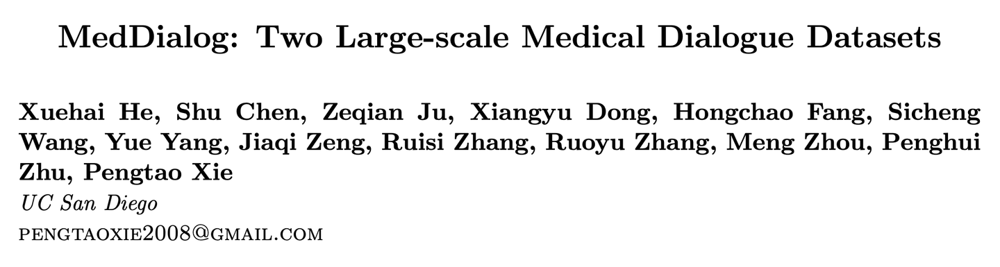

---
dataset_entry: true
dataset_name: "MedDialog-CN"
dataset_path: "1-Dataset/MedDialog-CN.md"
dimensions: ""
modality: ""
task_type: ""
anatomical_structures: ""
anatomical_area: ""
number_of_categories: ""
data_volume: ""
file_format: ""
source_url: "https://github.com/UCSD-AI4H/Medical-Dialogue-System"
publication_date: "2020.7"
tags:
  - dataset
---
# MedDialog-CN

<div align="center">
    <a href="https://github.com/openmedlab/"></a>
</div>
<p style="text-align:center;font-size:10px;"><em></em></p>

## Dataset Information

MedDialog-CN is a large-scale dataset specifically designed for research on Chinese medical dialogues, containing more than 1.1 million dialogues and 4 million utterances. These original dialogues are sourced from Haodaoctor Online (http://haodf.com). All data copyrights are owned by Haodaoctor Online. This dataset encompasses a wide range of topics from common disease consultations to professional medical advice, aimed at supporting and promoting the development of medical dialogue systems. These systems are expected to improve the accessibility and quality of medical services by providing automated health consultations and support.

The value of the MedDialog-CN dataset lies in providing a precious resource for researchers in the fields of artificial intelligence and machine learning, enabling them to develop and test advanced natural language processing algorithms. These algorithms aim to understand and generate human-like medical dialogues, thus providing patients with accurate and timely medical information, helping to alleviate doctors' workload, and improving the overall efficiency of the medical system.

## Dataset Meta Information

| Task Type | Language | Train | Val | Test | File Format | Size |
|-----------|----------|-------|-----|------|-------------|------|
| QA        | Chinese  | 1.1M  | -   | -    | .txt        | 6.64G |


## Dataset Information Statistics

These consultations cover 29 broad professional fields, including internal medicine, pediatrics, dentistry, etc., as well as 172 sub-specialties, including cardiology, neurology, gastroenterology, urology, and more. The consultations took place between 2010 and 2020.

| Dataset                         | #dialogs | #diseases |
|---------------------------------|----------|------------|
| Muzhi (Wei et al., 2018)        | 710      | 4          |
| Dxy (Xu et al., 2019)           | 527      | 5          |
| COVID-EN (Yang et al., 2020)    | 603      | 1          |
| COVID-CN (Yang et al., 2020)    | 1,088    | 1          |
| MedDialog-EN                    | 257,454  | 96         |
| MedDialog-CN                    | 3,407,494| 172        |

Table 1: Comparison with other datasets.
## Dataset Example

An example consultation includes (1) the patient's description of their condition and medical history, (2) the dialogue between the doctor and patient, and (3) the diagnosis and treatment recommendations provided by the doctor.

``` 
### Description of medical conditions and history

鐤剧梾锛氬疂瀹濈溂鐫涚孩绾㈢殑锛屼弗閲嶆椂绋嶅井婧冪儌銆?(Disease: The baby鈥檚 eyes are red and slightly ulcerated when becoming severe.)

鐥呮儏鎻忚堪锛氬疂瀹濈溂鐫涚孩绾㈢殑銆佺棐鐥掔殑锛岀敤鎵嬫弶锛屼弗閲嶆椂銆傜敤浜?burt's bee鏁戞€ヨ啅鍚庤繃鍘诲張鍙嶅鍑烘潵浜?(Description of medical condition: The baby's eyes are red and itchy, scratched with hand, and slightly ulcerated when becoming severe. After using Burt's bee Res-Q ointment, it disappeared quickly but came out after two days.)

闇€瑕佸尰鐢熷府鍔╃殑閮ㄥ垎锛氬疂瀹濈溂鐫涚孩鏄€庝箞鍥炰簨锛?(Help needed: What's wrong with baby's red eyes?)

鎸佺画澶氫箙锛氫竴涓湀鍐?(Hong long the condition has been: Less than one month)

杩囨晱鍙诧細鏃?(Allergies: No)

鏃㈠線鐥呭彶锛氭棤
(Past medical history: No)

### Dialogue

鍖荤敓锛氭劅璋㈡偍鐨勪俊浠伙紝鐥呮儏鎻忚堪鎴戝凡璇︾粏闃呰銆傛牴鎹幇鏈夌殑鐥呮儏锛岃瘖鏂細鐫戞澘鑵虹値銆傚浘鐗囦笉鏄緢娓呮櫚銆傜粡甯告尃鍚楋紵
(Doctor: Thank you for your trust. I have read the medical information in detail. Based on the existing information, the diagnosis is blepharitis. The picture is not very clear. Scratch it often, right?)

鎮ｈ€咃細鍑虹敓鍒扮幇鍦ㄩ兘鍙枬涓€鐐瑰ザ锛屽槾宸磋€佹槸骞插共鐨勶紝涔熶笉鍍忓埆鐨勫疂瀹濇祦鍙ｆ按
(Patient: Drinks little amount of milk since birth, and the baby鈥檚 lips are always dry, and not drooling like other babies.)

鍖荤敓锛氱溂閮ㄥ眬閮ㄦ湁鍏宠妭鐐?(Doctor: Eyes have local arthritis.)

鎮ｈ€咃細鏄殑
(Patient: Yes)

鍖荤敓锛氱粰瀹濆疂鐢ㄥΕ甯冮湁绱犲拰鍦板绫虫澗鐪艰嵂鑶忎竴澶╀袱娆?(Doctor: Use Tobramycin and Dexamethasone eye ointment twice a day)

鎮ｈ€咃細杩欎釜鎬庝箞鍥炰簨
(Patient: What's going on?)

鍖荤敓锛氳€冭檻鐫戞澘鑵虹値鎴栬€呯潙鐐?(Doctor: Consider blepharitis or blepharitis)

鎮ｈ€咃細涓ラ噸鍚?(Patient: is it severe?)

鍖荤敓锛氱洰鍓嶄笉锛岀粰鐐硅嵂鐗╁厛鐢ㄥ嚑澶╃湅鐪?(Doctor: At present, it is not severe. Try to take the medications for a few days first.)

鎮ｈ€咃細鍝?(Patient: OK)

鍖荤敓锛氭不鐤楁湁浠€涔堟晥鏋滃憡璇夋垜
(Doctor: Let me know how it works.)

### Diagnosis and suggestions

鐥呮儏鎽樿鍙婂垵姝ュ嵃璞★細鐫戞澘鑵虹値
(Summary of the condition and initial impressions: Blepharitis)

鎬荤粨寤鸿锛氬眬閮ㄧ値鐥囥€傜粰瀹濆疂鐢ㄥΕ甯冮湁绱犲拰鍦板绫虫澗鐪艰嵂鑶忎竴澶╀袱娆★紝瑙傚療鐤楁晥鎯呭喌銆傚繀瑕佹椂鍘诲尰闄㈠氨璇娿€?(Summary of recommendations: For local inflammation, use Tobramycin and Dexamethasone eye ointment eye ointment twice a day, monitor the recovery, and go to the hospital if necessary.)
```

## File Structure

The dataset is divided into 11 text files named after the years, each representing the data crawled from the http://haodf.com website for that particular year.

``` 
.
|
|--  2010.txt
|--  2011.txt
|--  ...
`--  2020.txt
```

## Authors and Institutions

Xuehai He, Shu Chen, Zeqian Ju, Xiangyu Dong, Hongchao Fang, Sicheng

Wang, Yue Yang, Jiaqi Zeng, Ruisi Zhang, Ruoyu Zhang, Meng Zhou, Penghui

Zhu, Pengtao Xie (University of California San Diego)


## Source Information

Official Website: https://github.com/UCSD-AI4H/Medical-Dialogue-System

Download Link: https://drive.google.com/drive/folders/1r09_i8nJ9c1nliXVGXwSqRYqklcHd9e2

Article Address: https://arxiv.org/pdf/2004.03329v2.pdf

Publication Date: 2020.7

## Citation

``` 
@article{chen2020meddiag,
  title={MedDialog: a large-scale medical dialogue dataset},
  author={Chen, Shu and Ju, Zeqian and Dong, Xiangyu and Fang, Hongchao and Wang, Sicheng and Yang, Yue and Zeng, Jiaqi and Zhang, Ruisi and Zhang, Ruoyu and Zhou, Meng and Zhu, Penghui and Xie, Pengtao},
  journal={arXiv preprint arXiv:2004.03329}, 
  year={2020}
}
```

Original introduction article is [here](https://zhuanlan.zhihu.com/p/684788517).
