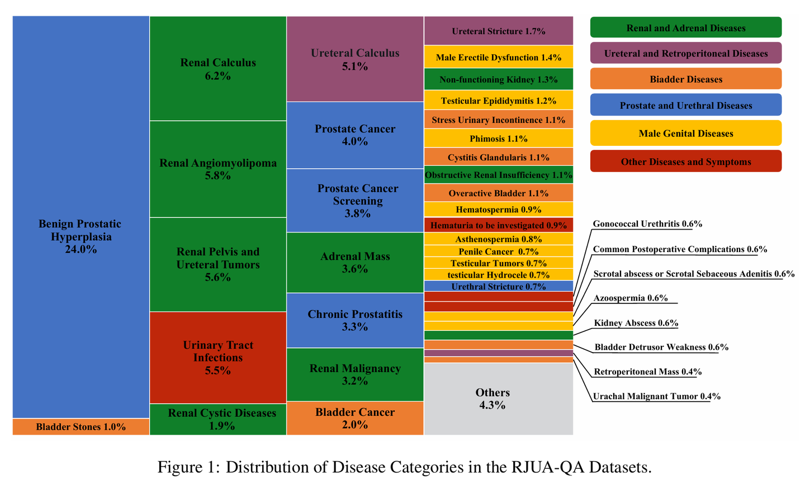
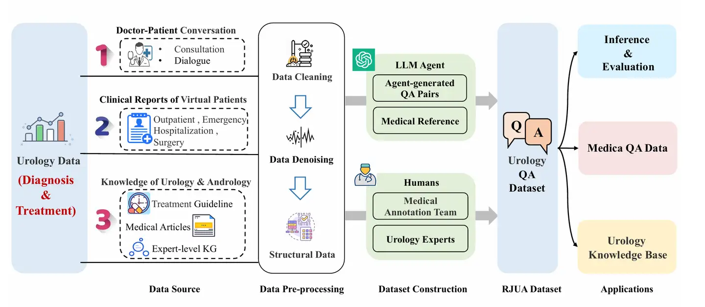
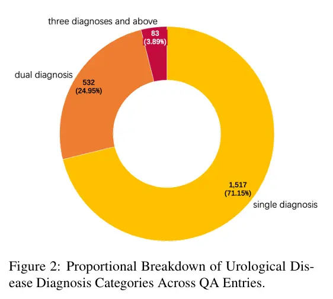

---
dataset_entry: true
dataset_name: "RJUA-QA"
dataset_path: "1-Dataset/RJUA-QA.md"
dimensions: ""
modality: ""
task_type: ""
anatomical_structures: ""
anatomical_area: ""
number_of_categories: ""
data_volume: ""
file_format: ""
source_url: "https://github.com/alipay/RJU_Ant_QA/"
publication_date: "2023"
tags:
  - dataset
---
# RJUA-QA

<div align="center">
    <a href="https://github.com/openmedlab/"></a>
</div>
<p style="text-align:center;font-size:10px;"><em></em></p>

## Dataset Information

The RJUA-QA (RenJi hospital Department of Urology and Antgroup Collaborative Question and Answer dataset) is an innovative medical urology-specific QA reasoning dataset. This dataset is a collaborative creation by the AntGroup Medical LLM team and the expert team from the Department of Urology at the Renji Hospital, affiliated with the Shanghai Jiao Tong University School of Medicine. The development of this dataset aims to transform real clinical patient data into virtual patient clinical dialogues presented in a Q&A format, with data production being a collaborative effort between AI technology and expert teams to ensure high efficiency and accuracy. **The case data in this dataset is compiled by professional doctors based on clinical experience, thus it does not involve any personal privacy of patients and doctors.**

The RJUA-QA dataset contains 2,132 question-answer pairs, each crafted by doctors based on clinical experience with expert-provided answers and relevant reasoning contexts, derived from Chinese Urological and Andrological disease diagnosis and treatment guidelines. The dataset encompasses urological disease data collected from outpatient diagnoses, emergency interventions, hospital surgeries, and daily public education from 2019 to 2023, ensuring comprehensive coverage and depth across multiple medical scenarios. The dataset focuses on ten sub-specialties within urology, including but not limited to urological tumors, stones, prostate diseases, male health, urinary incontinence, urological reconstructive surgery, pediatric urological diseases, and kidney transplantation, covering over 97.6% of urological patient visits. Constructed with the involvement of the professional medical team from Renji Hospital's Department of Urology, the RJUA-QA dataset not only guarantees the authenticity and accuracy of its data but also offers significant practical value for real-world medical applications.

<div align="center">
    <a href="https://github.com/openmedlab/"></a>
</div>
<p style="text-align:center;font-size:10px;"><em>Dataset construction process.</em></p>

## Dataset Meta Information

| Task Type | Language  | Train | Val | Test | File Format | Size    |
|-----------|-----------|-------|-----|------|-------------|---------|
| QA        | Chinese   | 1705  | 211 | 213  | .json       | 11.7MB  |

The number is the actual download amount.

## Dataset Information Statistics

67 common urological disease categories, which cover more than 97.6% of cases among the medical population.

| Category                            | Diseases/Symptoms                                   |
|-------------------------------------|-----------------------------------------------------|
| **Renal and Adrenal Diseases**      | Adrenal Mass                                        |
|                                     | Renal Malignancy                                    |
|                                     | Renal Angiomyolipoma                                |
|                                     | Renal Pelvis and Ureteral Tumors                    |
|                                     | Renal Calculus                                      |
|                                     | Renal Cystic Diseases                               |
|                                     | Renal Abscess                                       |
|                                     | Renal Trauma                                        |
|                                     | Spontaneous Renal Rupture                           |
|                                     | Obstructive Nephropathy                             |
|                                     | Non-functioning Kidney                              |
|                                     | Duplex Kidney                                       |
|                                     | Polycystic Kidney Disease                           |
|                                     | Renal Transplantation                               |
| **Bladder Diseases**                | Bladder Cancer                                      |
|                                     | Overactive Bladder                                  |
|                                     | Bladder Stones                                      |
|                                     | Bladder Diverticulum                                |
|                                     | Bladder Foreign Body                                |
|                                     | Vesicovaginal Fistula                               |
|                                     | Vesicoureteral Fistula                              |
|                                     | Cystitis Glandularis                                |
|                                     | Bladder Detrusor Weakness                           |
|                                     | Stress Urinary Incontinence                         |
|                                     | Neurogenic Bladder                                  |
|                                     | Urachal Cyst                                        |
|                                     | Urachal Cancer                                      |
|                                     | Urachal Anomaly                                     |
| **Prostate and Urethral Diseases**  | Benign Prostatic Hyperplasia                        |
|                                     | Acute Prostatitis                                   |
|                                     | Chronic Prostatitis                                 |
|                                     | Prostate Cancer                                     |
|                                     | Prostate Cancer Screening                           |
|                                     | Urethral Stricture                                  |
|                                     | Urethral Diverticulum                               |
|                                     | Urethral Foreign Bodies                             |
|                                     | Gonococcal Urethritis                               |
| **Male Genital Diseases**           | Balanoposthitis                                     |
|                                     | Phimosis                                            |
|                                     | Prepuce                                             |
|                                     | Preputial Scars                                     |
|                                     | Frenular Tear                                       |
|                                     | Penile Cancer                                       |
|                                     | Scrotal Gangrene                                    |
|                                     | Scrotal Abscess                                     |
|                                     | Scrotal Trauma                                      |
|                                     | Seminal Vesiculitis                                 |
|                                     | Spermatic Cord Cyst                                 |
|                                     | Epididymal Cyst                                     |
|                                     | Testicular Tumor                                    |
|                                     | Epididymo-orchitis                                  |
|                                     | Testicular Torsion                                  |
|                                     | Hydrocele Testis                                    |
|                                     | Cryptorchidism                                      |
|                                     | Erectile Dysfunction                                |
|                                     | Male Infertility                                    |
|                                     | Azoospermia                                         |
|                                     | Oligozoospermia                                     |
|                                     | Hematospermia                                       |
| **Ureteral and Retroperitoneal Diseases** | Ureteral Calculus                             |
|                                     | Ureteral Stricture                                  |
|                                     | Retroperitoneal Mass                                |
|                                     | Pelvic Lipomatosis                                  |
|                                     | Retroperitoneal Fibrosis                            |
| **Other Diseases and Symptoms**     | Urinary Tract Infections                            |
|                                     | Common Postoperative Complications                  |
|                                     | Hematuria of Unknown Origin                         |


## Visualization


<div align="center">
    <a href="https://github.com/openmedlab/"></a>
</div>
<p style="text-align:center;font-size:10px;"><em>Common urological disease categories and proportions.</em></p>

<div align="center">
    <a href="https://github.com/openmedlab/"></a>
</div>
<p style="text-align:center;font-size:10px;"><em>24.95% (532/2132) of patients in the dataset had two urological diagnoses. 3.99% (83/2132) of patients had three or more urological diagnoses.</em></p>

## Dataset Example

``` 
{
  "id": "4",
  "question": "鍖荤敓鎮ㄥソ锛屾垜鏄?0宀佺敺鎬э紝2澶╁墠鍑虹幇鍙充晶鑵扮棝锛屽翱閲忓噺灏戞潵灏卞尰銆傚埌浜嗗尰闄㈡€ヨ瘖妫€鏌T锛氬弻渚т晶杈撳翱绠′笂娈电粨鐭充即绉按銆傝鎸囨爣锛氱櫧缁嗚優 15.6锛屼腑鎬х矑缁嗚優鐧惧垎姣?83%锛岃绾㈣泲鐧?127锛岃灏忔澘 251锛孋鍙嶅簲铔嬬櫧 91锛岄潤鑴夎姘擯H7.28锛岃閽?138, 琛€閽?4.6, AB 21锛屼钩閰?0.8锛岃鑲岄厫 865锛岄檷閽欑礌鍘?0.245銆傝闂垜鏄粈涔堣瘖鏂紝璇ュ浣曟不鐤楋紵",
  "context": [
    "Context锛氫复搴婅〃鐜帮細1.鐤肩棝锛氬吀鍨嬬殑琛ㄧ幇涓鸿偩缁炵棝锛屽彲浠ユ槸鎸佺画鎬т絾甯搁樀鍙戞€у姞鍓у苟鍚戜細闃撮儴鏀惧皠銆備絾鍦ㄦ參鎬ч€愭笎浜х敓鐨勬闃绘€ц偩鐥呮偅鑰咃紝鏈夋椂鐤肩棝涓嶄竴瀹氬緢绐佸嚭锛屽伓鐒朵粎琛ㄧ幇涓鸿叞閰镐笉閫傜瓑銆傝偩鑴忎綋绉湪鎬ユ€у師鍥犲紩璧风殑姊楅樆鎬ц偩鐥呭彲浠ユ槑鏄捐偪澶э紝浣嗘參鎬ц€呭垯鍥犱负鏈変笉灏戠氦缁寸粍缁囧鐢熻€咃紝浣撶Н鍒欎笉涓€瀹氬澶э紝涓嶅皯鐥呬緥鐥呬晶鑲捐剰鍙嶈€岃悗缂┿€?.鎺掑翱闅滅锛氬弻渚у畬鍏ㄦ€ф闃诲彲浠ラ€犳垚鏃犲翱锛屼絾澶ч儴鍒嗘湰鐥呮偅鑰呮闃诲苟涓嶅崄鍒嗗畬鍏紝鍥犳澶氬憟澶氬翱銆傚湪缁х画鍙戜綔鐨勭梾渚嬫湁鏃跺彲鍛堢幇鍦ㄥ彂浣滄椂鍙互鏃犲翱锛屽彂浣滈棿鏈熷灏胯〃鐜般€傚湪鎰熸煋鍘熷洜鎵€鑷存闃荤梾渚嬶紝鍙兘鍑虹幇鑶€鑳卞埡婵€鐥囩姸銆傜敱鑶€鑳遍閮ㄩ樆濉炲紩璧疯€咃紙渚嬪鍓嶅垪鑵鸿偉澶э級鍒欏彲鏈夊翱娼寸暀琛ㄧ幇銆?.楂樿鍘嬶細鐩稿綋甯歌锛屽叾鏈哄埗鍙洜鑲惧皬绠¤厰鍐呭帇杩囬珮锛屾垨闂磋川鍘嬭繃楂樼瓑淇冧娇鑲剧礌鍒嗘硨杩囧锛涗篃鍙互鍥犺偩瀵规按銆侀挔璋冭妭鏈哄埗闅滅锛屽鑷存按銆侀挔娼寸暀鑰屽彂鐢熼珮琛€鍘嬨€備竴鑸敱鍗曚晶鑲捐剰鐥呭彉瀵艰嚧鏈梾鑰屽彂鐢熺殑楂樿鍘嬩互鑲剧礌渚濊禆鍨嬩负澶氾紝鍙屼晶鐥呭彉寮曡捣鑰呭垯姘撮挔渚濊禆鍨嬩负澶氭暟銆傛闃昏В闄ゅ悗楂樿鍘嬩竴鑸彲浠ュソ杞€備絾濡傛灉鐥呭彉鏃堕棿宸茶緝闀匡紝鍒欓珮琛€鍘嬫湁鏃跺彲鎸佺画鐩稿綋闀挎椂闂淬€?.绾㈢粏鑳炲澶氱棁锛氫富瑕佺敱浜庤偩鐩傜Н姘村埡婵€淇冪孩缁嗚優鐢熸垚婵€绱犲垎娉岃繃澶氳€岃嚧銆傚湪澶栫鎵嬫湳绾犳姊楅樆鍚庤繃楂樼殑琛€缁嗚優鍘嬬Н鍙互涓嬮檷銆備絾涓村簥涓婄湡姝ｅ嚭鐜板吀鍨嬫湰鐥囪€呭苟涓嶄竴瀹氬緢澶氥€?.閰镐腑姣掞細涓昏鍥犱负褰卞搷鑲惧皬绠″H+鐨勫垎娉岃€岃嚧銆傞儴鍒嗙梾渚嬪彲鍚堝苟鏈夎閽捐繃楂樸€?,
    "Context锛氭鏌ワ細1.灏垮父瑙勶細灏垮父瑙勪腑渚濈梾鍥犱笉鍚屼篃鍙笉鍚屻€傚ぇ澶氭暟鐥呬緥鏈夎泲鐧藉翱锛屼絾涓洪噺涓€鑸笉澶氥€傜孩銆佺櫧缁嗚優甯稿彲瑙傚療鍒般€傜敱缁撶煶鑲跨槫绛夊紩璧疯€咃紝琛€缁嗚優鍙互鐢氬锛屾湁鏃舵湁鑲夌溂琛€灏裤€佸悎骞舵劅鏌撳垯鍙湁杈冨鐧界粏鑳炪€傝偩涔冲ご鍧忔寮曡捣鑰咃紝灏夸腑涓嶄粎鍙湁杈冨绾㈢粏鑳烇紝涔熷浼存湁杈冨鐧界粏鑳炪€傛鏃跺吀鍨嬬殑灏挎恫鑹插憟鈥滄礂鑲夋按鈥濇牱锛岀孩绾卞竷婊よ繃鍚庡彲鐪嬪埌鍧忔缁勭粐銆傜鍨嬫鏌ュ父鍙彁绀虹梾鍥狅紝渚嬪鐢辩：鑳鸿嵂锛屽翱閰哥瓑寮曡捣锛屽叾鐗规畩缁撴櫠鍙檮鍦ㄧ鍨嬩笂銆傚悎骞舵劅鏌撹€呯殑鐥呬緥锛屽叾灏縫H甯稿崌楂橈紝濡傛灉pH鍊煎湪7.5浠ヤ笂鑰呭ぇ澶氭彁绀烘闃绘椂闂村凡涔咃紝涓旂梾鍙樺凡杈冩參鎬с€?.B瓒呮鏌ワ細闄ゅ彲娴嬪緱鑲捐剰澶у皬澶栵紝杩樺彲鎺㈠緱鑲剧泜绉按鎯呭喌锛屼笉灏戠粨鐭充篃鍙帰寰椼€傚鏋滄鏌ヤ腑鍙戠幇鎺掑翱鍚庤唨鑳卞唴娼村翱浠嶇劧寰堝锛屽垯鎻愮ず鏈夊墠鍒楄吅鑲ュぇ銆佽偪鐦ゆ垨鑰呯缁忔簮鎬ч€犳垚銆?.鑵归儴X绾垮钩鐗囷細鍙互鎺㈡祴鍑洪槼鎬у翱璺粨鐭筹紝鐢辩粨鏍告潌鑿屽紩璧疯€呭垯鍙湪鑵硅厰鍐呭強鑲惧尯瑙佸埌閽欏寲鐏讹紝鍚屾椂涔熷彲澶ц嚧瑙傚療鍒拌偩鑴忓ぇ灏忋€侰T闄ゅ彲娴嬪緱鑲捐剰澶у皬浠ュ锛岃繕鍙鍑烘湁鍚﹂泦鍚堢绯荤粺鎵╁紶鐨勬儏鍐点€傜壒鐐规槸濡傛灉鐢辫偪鐦わ紙鑲惧唴鎴栬偩澶栵級銆佽吂鑵斿悗鐥呭彉绛夊紩璧疯€咃紝鍒欏纭瘖鏇翠负閲嶈銆傚皯閮ㄥ垎鐗规畩鐥呬緥闇€琛岄€嗚杈撳翱绠￠€犲奖銆傞儴鍒嗘€ユ€ф闃荤梾渚嬬粡闈欒剦鑲剧泜閫犲奖鍚庡彲浠ュ府鍔╂槑纭梾鍥犮€?,
    "Context锛氭不鐤楁牴鎹梾鍥犺€屽畾锛岀粨鐭冲彲鐢ㄩ渿娉㈢鐭虫柟娉曡€屽幓闄わ紝涓€鑸缁撶煶7锝?5mm澶у皬鑰呰緝鏈夋晥銆傚湪杈撳翱绠′腑涓嬫缁撶煶缁忎繚瀹堟不鐤楋紙楗按銆佷腑鑽瓑锛夊悗浠嶆棤鏁堣€呭簲閲囩敤鍦ㄨ唨鑳遍暅涓嬮€嗚鍙栫煶鏂规硶锛屾湁鏃剁粨鐭冲奖鍝嶈偩鍔熻兘鎴栫敤涓婃硶涓嶈兘鎴愬姛鑰呭垯闇€澶栫鎵嬫湳鍘婚櫎銆傚父甯搁渶瑕佸悓鏃朵娇鐢ㄦ姉鐢熺礌锛屼笉灏戞闃绘€ц偩鐥呮闃诲苟涓嶅畬鍏紝浣嗗洜缁у彂鎰熸煋閫犳垚姘磋偪锛岀値鐥囧垎娉岀墿闃诲绛夊彲浠ヤ娇姊楅樆鍙樺緱鏇存槑鏄撅紝缁忔姉鐢熺礌浣跨敤鍚庯紝姊楅樆鍙互鏄庢樉濂借浆锛屼絾浣跨敤鍓傞噺鍙婇€夋嫨鐢ㄨ嵂闇€渚濇嵁鍩瑰吇鍙婅偩鍔熻兘鎯呭喌鑰屽姞浠ヨ皟鏁淬€傜敱鑲跨槫绛夊師鍥犲紩璧疯€呴渶搴旂敤鍖栫枟鎴栧绉戞墜鏈鐞嗐€傛闃诲悗鎵€鍑虹幇鐨勫灏跨瓑閫犳垚姘淬€佺數瑙ｈ川绛夌磰涔卞簲鍙婃椂浜堜互绾犳銆?,
    "Context锛氫笂灏胯矾缁撶煶鍖呮嫭鑲剧粨鐭冲拰杈撳翱绠＄粨鐭炽€傝偩缁撶煶鍒嗕负鑲鹃泦鍚堢缁撶煶銆佽偩鐩?鑲剧洀鎲╁)缁撶煶銆佽偩鐩傜粨鐭炽€侀箍瑙掑舰缁撶煶銆傝緭灏跨缁撶煶鍙垎涓鸿緭灏跨涓婃缁撶煶銆佷腑娈电粨鐭冲強涓嬫缁撶煶銆?,
    "Context锛氭墍鏈夊叿鏈夋硨灏跨郴缁撶煶涓村簥鐥囩姸鐨勬偅鑰呴兘搴旇杩涜褰卞儚瀛︽鏌ワ紝鍏剁粨鏋滃浜庣粨鐭崇殑杩涗竴姝ヨ瘖娌诲叿鏈夐噸瑕佷环鍊笺€傝秴澹版尝妫€鏌ヨ秴澹版尝妫€鏌ュ彲浣滀负娉屽翱绯荤粨鐭崇殑甯歌妫€鏌ユ柟娉曪紝鏇存槸鍎跨鍜屽瓡濡囧湪鎬€鐤戞硨灏跨郴缁撶煶鏃剁殑棣栭€夋柟娉曘€傚叾浼樼偣鏄畝渚裤€佺粡娴庛€佹棤鍒涗激锛屽彲浠ュ彂鐜?mm浠ヤ笂缁撶煶銆傜敱浜庡彈鑲犻亾鍐呭鐗╃殑褰卞搷锛岃秴澹版尝妫€鏌ヨ瘖鏂緭灏跨涓笅娈电粨鐭崇殑鏁忔劅鎬ц緝浣庛€?,
    "Context锛氶儴鍒嗘偅鑰呭彲浠ラ€氳繃淇濆畧娌荤枟鑷彂鎬ф帓鍑虹粨鐭炽€傜粨鐭宠嚜鍙戞€ф帓鍑轰笌缁撶煶鐨勯儴浣嶅拰澶у皬鏈夊叧[35]銆?9%鐨勮緭灏跨涓婃缁撶煶銆?8%鐨勪腑娈电粨鐭冲拰68%鐨勮繙绔緭灏跨缁撶煶鍙嚜琛屾帓鍑恒€?5%鐨?5mm鐨勭粨鐭冲拰62%鐨?5mm鐨勭粨鐭冲彲鑷鎺掑嚭锛屾帓鍑虹粨鐭崇殑骞冲潎鏃堕棿绾︿负17澶?鑼冨洿6~29澶?[36]銆傞殢鐫€缁撶煶澶у皬鐨勫鍔犵粨鐭宠嚜琛屾帓鍑虹殑姒傜巼浼氶€愭鍑忓皯锛屽苟涓斾釜浣撴偅鑰呬箣闂村瓨鍦ㄥ樊寮傘€?,
    "Context锛氫績鎺掔煶鑽墿鍖呮嫭伪鍙椾綋闃绘粸鍓傘€侀挋閫氶亾鎶戝埗鍓傚拰纾烽吀浜岄叝閰禫鍨嬫姂鍒跺墏(PDEI-5)[37]銆偽卞彈浣撻樆婊炲墏鐨勬帓鐭虫晥搴斿凡鍦ㄤ复搴婁腑寰楀埌璇佸疄锛屽杩滅杈撳翱绠＄粨鐭?5mm鐨勬偅鑰呬娇鐢ㄎ卞彈浣撻樆婊炲墏鍙鍔犳帓鐭虫鐜嘯38]銆傞儴鍒嗙爺绌朵笉鎺ㄨ崘鍦ㄨ嵂鐗╂帓鐭虫不鐤椾腑灏哖DEI-5鎴栫毊璐ㄧ被鍥洪唶涓幬卞彈浣撻樆婊炲墏鑱斿悎浣跨敤[30]銆?,
    "Context锛氫綋澶栧啿鍑绘尝纰庣煶鏈?extracorporealshockwavelithotripsy锛孍SWL)鏄埄鐢ㄤ綋澶栦骇鐢熺殑鍐插嚮娉㈣仛鐒︿簬浣撳唴鐨勭粨鐭充娇涔嬬矇纰庯紝缁ц€屽皢鍏舵帓鍑轰綋澶栦互杈惧埌娌荤枟鐩殑鐨勬不鐤楁柟娉曘€?,
    "Context锛?.闈炴墜鏈不鐤?瀵逛簬鐩村緞<5mm鐨勮緭灏跨缁撶煶锛岀害75%鍙嚜琛屾帓鍑猴紝鍥犳棣栭€夐潪鎵嬫湳娌荤枟;瀵逛簬鐩村緞5~10mm鐨勭粨鐭筹紝鍙湪瀵嗗垏鐩戞祴涓嬮€夌敤闈炴墜鏈不鐤梉142,143]銆傞潪鎵嬫湳娌荤枟鎺柦鍖呮嫭:澶ч噺楗按锛屾瘡澶?500~3000ml;閫傚害杩愬姩;搴旂敤闀囩棝鑽墿缂撹В鑲剧粸鐥涚棁鐘?瀹氭湡鐩戞祴缁撶煶浣嶇疆鍙婅偩绉按鐨勫彉鍖栥€傝緭灏跨缁撶煶鐨勫钩鍧囨帓鐭虫椂闂翠负6~29澶142]锛屽洜姝ゅ缓璁浜庢帓鐭崇殑闅忚瑙傚療浠?涓湀浠ュ唴涓哄疁銆?,
    "Context锛氶潪鎵嬫湳娌荤枟閫傚簲璇?1鏃犵棁鐘躲€佹棤姊楅樆鐨勮偩鐩忕粨鐭炽€佹啯瀹ょ粨鐭炽€侀珦璐ㄦ捣缁佃偩鎮ｈ€?2缁撶煶瀵艰嚧鎮ｈ偩鏃犲姛鑳姐€佹棤鐥囩姸銆佸渚ц偩鍔熻兘姝ｅ父鐨勬偅鑰?3瀛樺湪浣撳鍐插嚮娉㈢鐭冲強鍚勭鎵嬫湳绂佸繉璇佺殑鎮ｈ€呫€傞潪鎵嬫湳娌荤枟鐨勭瓥鐣ユ槸绾犳缁撶煶鐨勬槗鍙戝洜绱狅紝鏍规嵁24灏忔椂灏挎垚鍒嗗垎鏋愬強琛€鐢熷寲妫€鏌ワ紝璋冩暣楗缁撴瀯鍜岄ギ姘翠範鎯?鎺у埗BMI<25kg/m2;浣?4灏忔椂灏块噺缁存寔鍦?000ml浠ヤ笂[154];瀵逛簬楂樺翱閽欐偅鑰咃紝闄愮洂锛屼繚璇佹瘡鏃ラ挋鎽勫叆閲?000mg浠ヤ笂锛屽皯椋熷瘜鍚崏閰哥殑椋熺墿;閫傚綋杩愬姩銆?
  ],
  "answer": "鎮ㄥソ锛屾牴鎹偍鐨勬弿杩帮紝浣犵幇鍦ㄦ槸鍙屼晶杈撳翱绠＄粨鐭充即绉按鎰熸煋锛屾€ユ€ф闃绘€ц偩琛般€備綘搴旇灏藉揩琛屽弻渚ц緭灏跨鏀灦缃叆鏈紝鏈悗缁х画鎶楁劅鏌撱€佽ˉ娑层€佸鐥囨敮鎸佹不鐤楋紝瀵嗚鎮ｈ€呯敓鍛戒綋寰佸彉鍖栥€佹劅鏌撴寚鏍囥€佽偩鍔熻兘銆佺數瑙ｈ川鍙婂翱閲忋€?,
  "disease": "鍙屼晶杈撳翱绠＄粨鐭充即绉按鎰熸煋銆佹€ユ€ф闃绘€ц偩琛?,
  "advice": "鍙屼晶杈撳翱绠℃敮鏋剁疆鍏ユ湳銆佹湳鍚庢姉鎰熸煋銆佽ˉ娑层€佸鐥囨敮鎸佹不鐤?
}
```

## File Structure

The dataset is divided into three files, of which the training set and validation set are used for model training and validation, and the test set is used for model reasoning indicator evaluation.
```
RJUA_train
RJUA_valid
RJUA_test
```

## Authors and Institutions

- Shiwei Lyu (Ant Group)
- Chenfei Chi (Renji Hospital, affiliated with Shanghai Jiao Tong University School of Medicine)
- Hongbo Cai (Ant Group)
- Lei Shi (Ant Group)
- Xiaoyan Yang (Ant Group)
- Lei Liu (Ant Group)
- Xiang Chen (Ant Group)
- Deng Zhao (Ant Group)
- Zhiqiang Zhang (Ant Group)
- Xianguo Lyu (Renji Hospital, affiliated with Shanghai Jiao Tong University School of Medicine)
- Ming Zhang (Renji Hospital, affiliated with Shanghai Jiao Tong University School of Medicine)
- Fangzhou Li (Renji Hospital, affiliated with Shanghai Jiao Tong University School of Medicine)
- Xiaowei Ma (Renji Hospital, affiliated with Shanghai Jiao Tong University School of Medicine)
- Yue Shen (Ant Group)
- Jinjie Gu (Ant Group)
- Wei Xue (Renji Hospital, affiliated with Shanghai Jiao Tong University School of Medicine)
- Yiran Huang (Renji Hospital, affiliated with Shanghai Jiao Tong University School of Medicine)

## Source Information

Official Website: https://github.com/alipay/RJU_Ant_QA/

Download Link: http://data.openkg.cn/dataset/rjua-qadatasets

Article Address: https://arxiv.org/abs/2312.09785

Publication Date: 2023

## Citation

``` 
@misc{lyu2023rjuaqa,
      title={RJUA-QA: A Comprehensive QA Dataset for Urology}, 
      author={Shiwei Lyu and Chenfei Chi and Hongbo Cai and Lei Shi and Xiaoyan Yang and Lei Liu and Xiang Chen and Deng Zhao and Zhiqiang Zhang and Xianguo Lyu and Ming Zhang and Fangzhou Li and Xiaowei Ma and Yue Shen and Jinjie Gu and Wei Xue and Yiran Huang},
      year={2023},
      eprint={2312.09785},
      archivePrefix={arXiv},
      primaryClass={cs.CL}
}
```

Original introduction article is [here](https://zhuanlan.zhihu.com/p/703924918).
