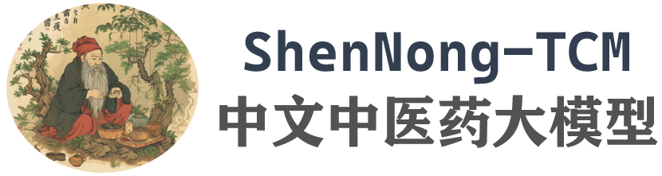
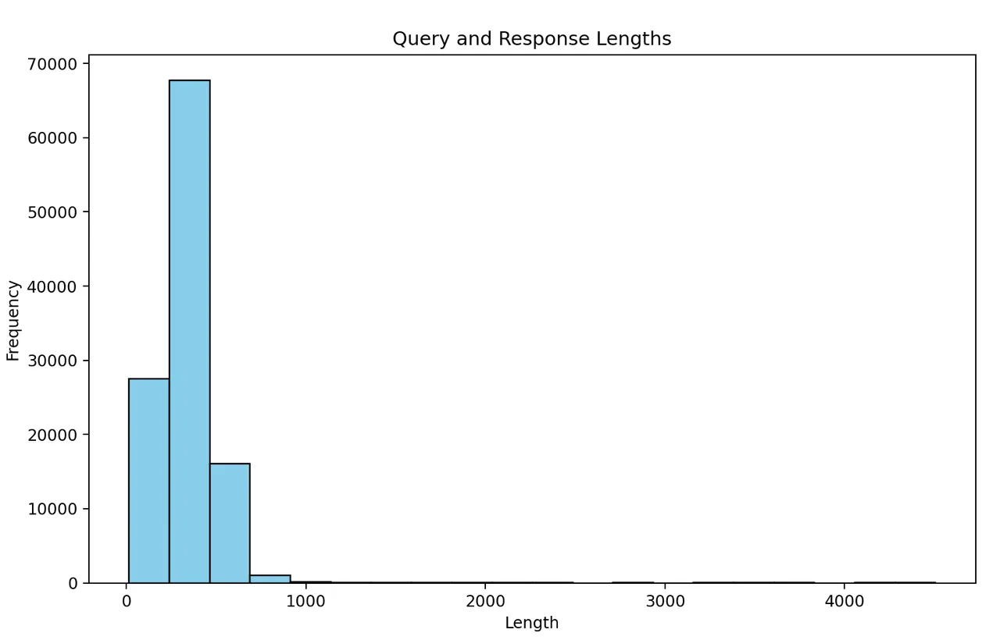

---
dataset_entry: true
dataset_name: "ShenNong-TCM-Dataset/EB"
dataset_path: "1-Dataset/ShenNong-TCM.md"
dimensions: ""
modality: ""
task_type: ""
anatomical_structures: ""
anatomical_area: ""
number_of_categories: ""
data_volume: ""
file_format: ""
source_url: "https://github.com/ywjawmw/TCMEB/blob/main"
publication_date: "2023-08"
tags:
  - dataset
---
# ShenNong-TCM-Dataset/EB

<div align="center">
    <a href="https://github.com/openmedlab/"></a>
</div>
<p style="text-align:center;font-size:10px;"><em></em></p>

## Dataset Information

The ShenNong-TCM (ShenNong-Traditional Chinese Medicine) series of large models represent an innovative exploration of large language models in the field of Traditional Chinese Medicine (TCM). By applying LoRA fine-tuning technology on carefully designed instruction data, the ShenNong-TCM model not only integrates more human care into its answers but also provides practical medical advice. Notably, the model can directly recommend suitable Chinese herbal medicines or prescriptions based on the patient's symptoms, rather than merely offering generic medical guidance.

The training and evaluation of ShenNong-TCM are based on two professional datasets: ShenNong-TCM-Dataset and ShenNong-TCM-EB (Evaluation Benchmark). ShenNong-TCM-Dataset, relying on the knowledge graph of traditional Chinese medicine, constructs an entity-centered dataset with the help of ChatGPT-3.5. Similarly, ShenNong-TCM-EB is also based on entities but originates from the question bank of the Traditional Chinese Medicine Practitioner Qualification Examination. Although the ShenNong-TCM series of datasets have not been widely publicized through published papers, all related materials can be found on GitHub and the Hugging Face platform. Unfortunately, although the ShenNong-TCM-Dataset has been released publicly, ShenNong-TCM-EB, despite having detailed examples and generation processes published, has not yet made its generated evaluation benchmark dataset available to the public. However, the question generation mechanism of ShenNong-TCM-EB still holds significant research value, which we will delve into in subsequent data example analyses.

## Dataset Meta Information

| Task Type | Language | Train | Val | Test | File Format | Size  |
|-----------|----------|-------|-----|------|---------|-------|
| QA        | Chinese  | 113K  | -   | 3,279	  | .json   | 110MB |


## Dataset Information Statistics

The training set consists of single-round question-answering pairs, with the specific length statistics of the Q&A shown below. It can be observed that the vast majority of the training data lengths are concentrated below 1000, which does not exceed the usage limit of the 2048 context window for many 7B models, thereby ensuring performance to a certain extent.

<div align="center">
    <a href="https://github.com/openmedlab/"></a>
</div>
<p style="text-align:center;font-size:10px;"><em></em></p>

The specific proportions as officially calculated are as follows:

| Question Type   | Single-Stem Single-Best Choice Questions (Type A1/A2) | Case Group Best Choice Questions (Type A3) | Standard Combination Questions (Type B1) | 
|-----------------|-----------------------------------------------------------|----------------------------------------------------|------------------------------------------|
| Question Number | 1600                                                      | 198                                                | 1481                                     |

## Dataset Example

The test set is divided into two main types of questions, A and B, with type A further divided into A1, A2, and A3. The specifics of these question types are as follows:

Best Choice Questions or Single-Answer Choice Questions (Type A): Each question consists of a stem followed by five possible answers labeled A, B, C, D, and E. Among these five options, only one is the correct answer. Type A questions are divided into two types, A1 and A2:
- Single-Sentence Best Choice Questions (Type A1): The stem appears in the form of a statement, which can be affirmative or negative.
- Case Summary Best Choice Questions (Type A2): A brief clinical case serves as the stem.
- Case Group Best Choice Questions (Type A3): The stem begins with a clinical scenario centered on a patient, followed by several (more than one) related questions. Each question is related to the initial clinical scenario but tests different points, mainly focusing on clinical application.

Standard Combination Questions (Type B1): Each question is made up of five possible answers labeled A, B, C, D, and E, followed by two or more stems. The options are presented first, followed by the stems. When answering, one must choose one option as the correct answer for each stem. Each option can be used zero, one, or more than once.

The instruction data in the ShenNong-TCM-Dataset is illustrated in the following figure, which shows a very clear structure.

``` 
{
    "query": 
        "鎴戣吂鐥涳紝娌℃湁鍏朵粬鐥囩姸锛屾湁浠€涔堜腑鑽彲浠ユ帹鑽愬悧锛?          瑕佹眰锛?. 璇疯€冭檻鎵€鏈夌棁鐘躲€?               2. 璇疯緭鍑烘帹鐞嗚繃绋嬶紝鎺ㄧ悊杩囩▼鍙兘娑夊強鐥囩姸銆佽瘉鍊欍€佹不娉曘€佹柟鍓?涓嵂绛変俊鎭€?, 
    "response": 
       "棣栧厛闇€瑕佺‘瀹氳吂鐥涚殑鎬ц川锛堝瘨鐑櫄瀹烇級锛岃繘鑰岀‘瀹氳瘉鍊欍€?        濡傛灉鑵圭棝涓哄瘨鎬э紝甯歌璇佸€欎负瀵掔枬锛屽叾鐥囩姸涓鸿吂鐥涚紦瑙ｄ簬娓╋紝鍔犻噸浜庡瘨锛?        鑵归儴鎰熻鍐风棝锛屽枩鎸夛紱鑲㈠喎锛岃剦娌夌揣銆傛不娉曞父鐢ㄦ俯缁忔暎瀵掋€佽姘旀鐥涳紝甯哥敤鏂瑰墏涓虹悊涓父銆佹俯涓堡绛夈€?        鍏朵腑锛岀悊涓父涓昏鎴愬垎涓洪粍杩炪€佸崐澶忋€佺敓濮滅瓑锛屽叿鏈夋俯涓暎瀵掋€佽姘旀鐥涚殑浣滅敤銆俓n\n
        濡傛灉鑵圭棝涓哄疄鎬э紝甯歌璇佸€欎负瀹炵枬锛屽叾鐥囩姸涓鸿吂鐥涘墽鐑堬紝涓嶅彈娓╁害褰卞搷锛?        鑵归儴鑳€婊★紝鍠滄寜锛涜垖鑻斿帤鑵伙紝鑴夋粦鏁般€傛不娉曞父鐢ㄦ竻鐑寲婀裤€佽姘旀秷鑲匡紝甯哥敤鏂瑰墏涓轰簩闄堟眽鑽€佹秷鐥炰父绛夈€?        鍏朵腑锛屼簩闄堟眽鑽富瑕佹垚鍒嗕负榛勮繛銆佸崐澶忋€佺敓濮溿€侀檲鐨瓑锛屽叿鏈夋竻鐑В姣掋€佽姘旀鐥涚殑浣滅敤銆俓n\n
        濡傛灉鑵圭棝涓鸿櫄鎬э紝甯歌璇佸€欎负铏氱枬锛屽叾鐥囩姸涓鸿吂鐥涘憟闂存瓏鎬с€侀殣鐥涙€ц川锛屽瑙佷簬鑴捐儍姘旇櫄銆佽偩姘旇櫄绛夈€?        娌绘硶甯哥敤琛ョ泭姘旇銆佸浐鎽勬鐥涳紝甯哥敤鏂瑰墏涓哄洓鍚涘瓙姹ゃ€佸叚鍚涘瓙涓哥瓑銆?        鍏朵腑锛屽洓鍚涘瓙姹や富瑕佹垚鍒嗕负浜哄弬銆佺櫧鏈€佽尟鑻撱€佺敇鑽夌瓑锛屽叿鏈夎ˉ鐩婅劸鑳冦€佸浐鎽勬鐥涚殑浣滅敤銆俓n\n
        缁间笂鎵€杩帮紝鍏蜂綋閫夋嫨涓嵂鏂瑰墏闇€瑕佹牴鎹吂鐥涚殑鎬ц川鍜岀浉搴旂殑璇佸€欐潵纭畾锛?        寤鸿灏卞尰骞跺湪鍖荤敓鎸囧涓嬭繘琛屼腑鑽不鐤椼€?
}
```

The data was constructed using ChatGPT-3.5, and the design of the construction prompt is as follows:

``` 
system_prompt = "浣犻渶瑕佸敖鍙兘缁欏嚭澶氭牱鍖栫殑锛屼笌涓尰(涓浗浼犵粺鍖诲),涓嵂绛夌浉鍏崇殑锛屼换鍔℃寚浠ゅ拰瀵瑰簲鐨勫洖绛斻€傛垜浠皢鐢ㄤ簬浜哄伐璇勪及ChatGPT妯″瀷瀵规寚浠ょ殑瀹屾垚鎯呭喌銆傝姹?\n"
system_prompt += "1. 涓婚澶氭牱鍖栵紝娑电洊涓嶅悓鐨勪腑鍖诲疄浣擄紝渚嬪锛? + "銆?.join(
    random.sample(entity_list, 10)
) + "绛夈€俓n"

# generate random tasks
task_list = ["寮€鏀惧紡鐢熸垚", "鍒嗙被", "闂瓟", "缂栬緫", "鎽樿",
             "鍐欎綔", "鍒嗘瀽", "甯歌瘑鎺ㄧ悊", "鍐欐枃鐚?,
             "鎶藉彇", "鎺ㄨ崘", "闂瘖", "鏂囩尞鏍囬鐢熸垚", "璇婃柇", "鏂瑰墏鎺ㄨ崘", "娌荤枟鎺ㄨ崘"]
system_prompt += "2. 琛ㄨ堪澶氭牱鍖栵紝缁撳悎鐪熷疄闂锛涙寚浠ょ被鍨嬪鏍峰寲锛屼緥濡傦細" + "銆?.join(random.sample(task_list, 10)) + "绛夈€俓n"

# other requirements
system_prompt += "3. 濡傛灉閬囧埌鏃犳硶澶勭悊鐨勬寚浠わ紙鍙潬鏂囨湰鏃犳硶鍥炵瓟锛夛紝缁欏嚭鏃犳硶澶勭悊鐨勫洖澶嶃€俓n"
system_prompt += "4. 闄ら潪鐗瑰埆瑕佹眰锛岃浣跨敤涓枃锛屾寚浠ゅ彲浠ユ槸鍛戒护鍙ャ€佺枒闂彞銆佹垨鍏朵粬鍚堥€傜殑绫诲瀷銆俓n"
system_prompt += "5. 涓烘寚浠ょ敓鎴愪竴涓€傚綋涓旀秹鍙婄湡瀹炴儏鍐电殑<input>锛屼笉搴旇鍙寘鍚畝鍗曠殑鍗犱綅绗︺€?input>搴旀彁渚涘疄璐ㄦ€х殑鍐呭锛屽叿鏈夋寫鎴樻€с€傚瓧鏁颁笉瓒呰繃" + str(
    random.randint(80, 120)) + "瀛椼€俓n"
system_prompt += "6. <output>搴旇鏄鎸囦护鐨勯€傚綋涓旂湡瀹炵殑鍥炲簲锛屼笉鑳藉彧鍥炲绛斿簲鎴栨嫆缁濊姹傘€傚鏋滈渶瑕侀澶栦俊鎭墠鑳藉洖澶嶆椂锛岃鍔姏棰勬祴鐢ㄦ埛鎰忓浘骞跺皾璇曞洖澶嶃€?output>鐨勫唴瀹瑰簲灏戜簬" + str(
    512) + "瀛椼€俓n\n"

system_prompt += "璇风粰鍑烘弧瓒虫潯浠剁殑5鏉SON鏍煎紡鏁版嵁锛歕n"
```

As previously mentioned, this generation method is entity-based. It involves making selections within a random task based on specific entities (medical entities and information from the knowledge graph) and providing randomly lengthened question-and-answer pairs within a certain range. This method ensures balance among the entities, preventing the training data from being biased towards a particular category.

The generation of the test set is similar, but there are more distinctions in the format, and, as previously mentioned, it is divided into various question types. Here is a specific example:

Single-Stem Single-Best Choice Questions (Type A1/A2):

``` 
 {
  "question": "銆婄礌闂峰挸璁恒€嬶細鈥滀簲鑴忓叚鑵戠殕浠や汉鍜斥€濓紝浣嗗叧绯绘渶瀵嗗垏鐨勬槸锛? 锛夈€俓nA锛庡績鑲篭nB锛庤偤鑲綷nC锛庤偤鑴綷nD锛庤偤鑳僜nE锛庤偤澶ц偁",
  "answer": [
    "D"
  ],
  "analysis": "鏍规嵁銆婄礌闂峰挸璁恒€嬧€滄鐨嗚仛浜庤儍锛屽叧浜庤偤锛屼娇浜哄娑曞斁鑰岄潰娴偪姘旈€嗕篃鈥濆彲鐭ヤ笌浜旇剰鍏厬鐨嗕护浜哄挸鍏崇郴鏈€瀵嗗垏鐨勮剰鑵戜负鑲鸿儍銆傛墜澶槾鑲虹粡璧蜂簬涓劍锛岃繕寰儍鍙ｏ紝涓婅唸灞炶偤銆傚瘨鍑夐ギ椋熷叆鑳冿紝瀵艰嚧涓劍瀵掞紝瀵掓皵寰墜澶槾鑲虹粡涓婂叆浜庤偤涓紝瀵艰嚧鑲哄瘨锛岃偤涓哄▏鑴忥紝涓嶈€愬瘨鐑紝澶栧唴瀵掗偑骞惰仛浜庤偤锛屽垯鑲哄け瀹ｉ檷锛岃偤姘斾笂閫嗗彂鐢熷挸鍡姐€傚洜姝ょ瓟妗堥€塂銆?,
  "knowledge_point": "涓尰缁忓吀",
  "index": 8196,
  "score": 1
}
```

Case Group Best Choice Questions (Type A3):

``` 
{
  "share_content": "鍒樏楋紝鐢凤紝46宀侊紝鍒讳笅鐪╂檿鑰岃澶撮噸濡傝挋銆傝兏闂锋伓蹇冿紝椋熷皯澶氬瘣锛岃嫈鐧借吇锛岃剦婵℃粦銆?,
  "question": [
    {
      "sub_question": "1)锛庤瘉灞烇紙  锛夈€俓nA锛庤倽闃充笂浜nB锛庢皵琛€浜忚櫄\nC锛庤偩绮句笉瓒砛nD锛庣棸娴婁腑闃籠nE锛庝互涓婇兘涓嶆槸\n",
      "answer": [
        "D"
      ],
      "analysis": ""
    },
    {
      "sub_question": "2)锛庢不娉曞疁閫夛紙  锛夈€俓nA锛庣嚗婀跨鐥帮紝鍋ヨ劸鍜岃儍\nB锛庤ˉ鑲炬粙闃碶nC锛庤ˉ鑲惧姪闃砛nD锛庤ˉ鍏绘皵琛€锛屽仴杩愯劸鑳僜nE锛庡钩鑲濇綔闃筹紝婊嬪吇鑲濊偩\n",
      "answer": [
        "A"
      ],
      "analysis": ""
    },
    {
      "sub_question": "3)锛庢柟鑽疁閫夛紙  锛夈€俓nA锛庡彸褰掍父\nB锛庡乏褰掍父\nC锛庡崐澶忕櫧鏈ぉ楹绘堡\nD锛庡綊鑴炬堡\nE锛庡ぉ楹婚挬钘らギ\n",
      "answer": [
        "C"
      ],
      "analysis": ""
    }
  ],
  "knowledge_point": "涓尰鍐呯瀛?,
  "index": 334,
  "score": 1
}
```

Standard Combination Questions (Type B1):

``` 
  {
  "share_content": "锛堝叡鐢ㄥ閫夌瓟妗堬級\nA.鍖栫棸鎭锛屽仴鑴剧婀縗nB.娓呰偤鍖栫棸锛屾暎缁撴帓鑴揬nC.鐤忛瀹ｈ偤锛屽寲鐥版鍜砛nD.娓呯儹鍖栫棸锛屽钩鑲濇伅椋嶾nE.娑﹁偤娓呯儹锛岀悊姘斿寲鐥癨n",
  "question": [
    {
      "sub_question": "1)锛庤礉姣嶇摐钂屾暎鐨勫姛鐢ㄦ槸锛? 锛夈€?,
      "answer": [
        "E"
      ],
      "analysis": ""
    },
    {
      "sub_question": "2)锛庡崐澶忕櫧鏈ぉ楹绘堡鐨勫姛鐢ㄦ槸锛? 锛夈€?,
      "answer": [
        "A"
      ],
      "analysis": ""
    }
  ],
  "knowledge_point": "鏂瑰墏瀛?,
  "index": 1938,
  "score": 1
}
```

## File Structure

The structure of the dataset is as follows, composed of two JSON files.

``` 
ShenNong_TCM_Dataset
|-- ChatMed_TCM-v0.2.json
|-- EB.json (to be release)
```

## Authors and Institutions

Wenjing Yue (Intelligent Knowledge Management and Service Team, School of Computer Science and Technology, East China Normal University)

Wei Zhu (Intelligent Knowledge Management and Service Team, School of Computer Science and Technology, East China Normal University)

Xiaoling Wang (Intelligent Knowledge Management and Service Team, School of Computer Science and Technology, East China Normal University)

## Source Information

Official Website: https://github.com/ywjawmw/TCMEB/blob/main

Download Link: https://huggingface.co/datasets/michaelwzhu/ShenNong_TCM_Dataset

Article Address: TBD

Publication Date: 2023-08

## Citation

``` 
@misc{yue2023 TCMEB,
  title={TCMEB: Performance Evaluation of Large Language Models Based on Traditional Chinese Medicine Benchmarks}, 
  author={Wenjing Yue, Wei Zhu and Xiaoling Wang},
  year={2023},
  publisher = {GitHub},
  journal = {GitHub repository},
  howpublished = {\url{https://github.com/ywjawmw/TCMEB}},
}
```

Original introduction article is [here](https://zhuanlan.zhihu.com/p/687327089).

